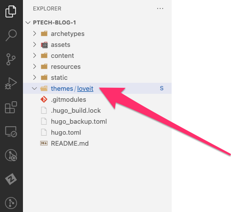
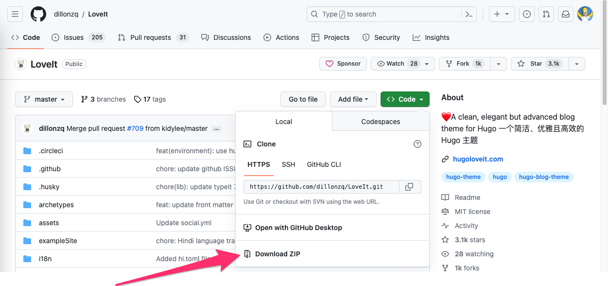
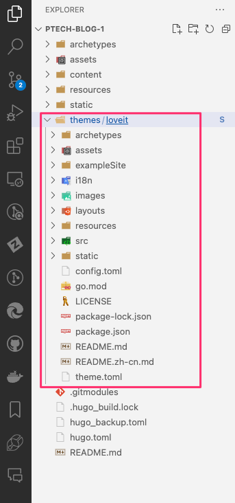

 ## Setting Up the Philico P-Tech Blog Locally

Follow these steps to set up the draft version of the Philico P-Tech Blog on your local machine:

1. **Setting Up the Workspace**:
   - Download and install [Visual Studio Code](https://code.visualstudio.com/).
   - Use Visual Studio Code to clone the Git Repository onto your local machine. To do this, click on the "Clone Repository" button on the welcome screen, or click on "Clone Repository" in the "Source Control" tab.

     

   - Enter the URL of the [P-Tech Blog GitHub Repository](https://github.com/philico-tech/ptech-blog.git) and choose a destination folder for the files.
   - Once the repository has been cloned, you can open the folder in Visual Studio Code.


2. **Preparation of the Render Files**:
   - Once you've cloned all the files, you may notice that the folder containing items for rendering the blog is empty.

     

   - To obtain the necessary files, navigate to the [LoveIt GitHub Repository](https://github.com/dillonzq/LoveIt).
   - Click on "Download ZIP" to get all the files.

     

   - Extract the ZIP and transfer its contents to the destination folder for the P-Tech Blog site.

     


3. **Starting the Local Server**:
   - Navigate to the destination folder using your terminal or command prompt.
   - Run the command:
     ```
     hugo server
     ```
   - This will start a local web server, and you can preview the blog in your browser.


     


Enjoy developing with the Philico P-Tech Blog!
=======
# Quickstart Backup That Works
Type "hugo server" in the terminal to start the server.

This is new content from VS Code
