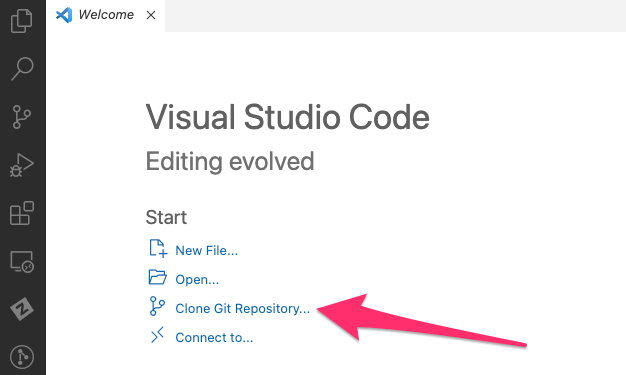
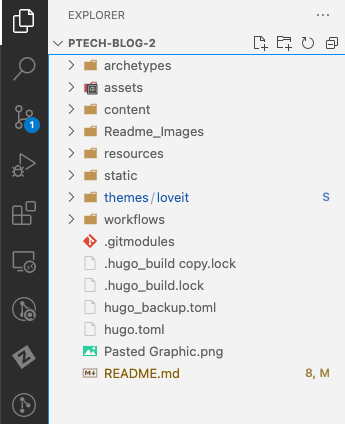

## 🛠 Development Environment Setup for the Philico P-Tech Blog

Streamline your development process for the Philico P-Tech blog using Visual Studio Code by following this guide.

### 1. Initialize the Workspace

- **Download & Install**: Begin by downloading and installing [Visual Studio Code](https://code.visualstudio.com/).

- **Clone the Repository**: 
  1. Launch Visual Studio Code.
  
  2. Opt for "Clone Repository" from the welcome screen or select it from the "Source Control" tab.

    

  3. Input the URL for the [P-Tech Blog GitHub Repository](https://github.com/philico-tech/ptech-blog.git) and designate a suitable location on your system.

  4. Upon successful cloning, you can access the repository directly within Visual Studio Code.

     

### 2. Activate the Local Server

  1. Use the terminal to navigate to the repository's location.

  2. Run the following command to initialize a local server:

     ```bash
     hugo server
     ```

  3. Post execution, the blog will be available for viewing in your preferred browser.

### 📌 Notes

- **Framework**: The Philico P-Tech blog has been developed using HUGO, a renowned open-source static site generator. To delve deeper into HUGO's capabilities, head over to [gohugo.io](https://gohugo.io).

- **Thematic Touch**: The blog aesthetic is amplified by the HUGO theme "LoveIt". Gather more insights about this theme at [Hugo Themes: LoveIt](https://themes.gohugo.io/themes/loveit/).
