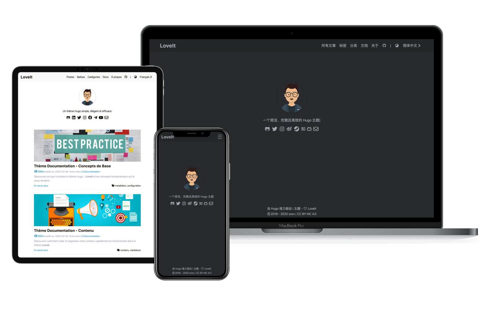

# LoveIt 主题 | Hugo

[](https://app.netlify.com/sites/hugo-loveit-zh/deploys)

[English README](README.md) | 中文说明

[LoveIt](https://github.com/dillonzq/LoveIt) 是一个**简洁**、**优雅**且**高效**的 [Hugo](https://gohugo.io/) 博客主题。

它的原型基于 [LeaveIt 主题](https://github.com/liuzc/LeaveIt/) 和 [KeepIt 主题](https://github.com/liuzc/LeaveIt/)。

由于三个主题外观的相似性，如果你对于它们的不同之处有疑问，请阅读 [为什么选择 LoveIt](#为什么选择-LoveIt)，以便你能选择最适合你的一个。



## 主题[预览](https://hugo-loveit-zh.netlify.com)

为了直观地浏览主题特性，这里有一个基于 **LoveIt** 主题渲染的 [预览网站](https://hugo-loveit-zh.netlify.com)。

## 为什么选择 LoveIt

相较于 LeaveIt 主题 和 KeepIt 主题，LoveIt 主题主要有以下修改

* 固定的标题栏
* 系统原生字体
* 主页副标题的打字机效果
* 焕然一新的主页文章列表，已经兼容最新版 Hugo
* 所有主题图标替换为 [Font Awesome](https://fontawesome.com/)
* 大量的样式细节调整，包括颜色、字体大小、边距、代码预览样式
* 可读性更强的暗黑模式
* 一些美观的 CSS 动画
* 易用和自动展开的文章目录，同时适配移动端
* 为了更适合作为博客主题，去除了画廊功能，但保留了图片懒加载以提高性能
* 使用 [Font Awesome](https://fontawesome.com/) 图标的扩展 Markdown 语法
* 支持基于 [Katex](https://katex.org/) 的数学公式
* 支持基于 [mermaid](https://github.com/knsv/mermaid) 的图表和流程图生成功能
* 支持基于 [APlayer](https://github.com/MoePlayer/APlayer) 和 [MetingJS](https://github.com/metowolf/MetingJS) 的内嵌音乐播放器
* 支持内嵌 Bilibili 视频
* 支持多种提醒样式的 shortcode
* 支持自定义对齐和浮动方式的 shortcode
* 支持所有第三方库的 CDN
* 更加丰富的自定义设置

所以，如果你更偏好 LoveIt 主题的设计语言和自由度，如果你想便捷地使用扩展的 Font Awesome 图标，如果你想在文章内嵌数学公式、流程图、音乐或是 Bilibili 视频，
那么，LoveIt 主题可能是更适合你。
希望你会 LoveIt ❤️!

## 特性

### 性能和 SEO

* 性能优化：在 [Google PageSpeed Insights](https://developers.google.com/speed/pagespeed/insights) 中， 99/100 的移动设备得分和 100/100 的桌面设备得分
* 使用基于 JSON-LD 格式 的 SEO SCHEMA 文件进行 SEO 优化
* 支持 [Google Analytics](https://analytics.google.com/analytics)
* 支持搜索引擎的网站验证 (Google, Bind, Yandex and Baidu)
* 支持所有第三方库的 CDN
* 基于 [lazysizes](https://github.com/aFarkas/lazysizes) 自动转换图片为懒加载

### 外观和布局

* 桌面设备/移动设备 响应式布局
* 暗黑/明亮 模式
* 页面和列表保持一致的视觉样式
* 支持分页
* 易用和自动展开的文章目录，同时适配移动端
* 支持多语言和国际化
* 美观的 CSS 动画

### 社交和评论系统

* 支持 [Gravatar](https://gravatar.com) 头像
* 支持本地头像
* 支持多达 54 种社交链接
* 支持文章分享
* 支持 [Disqus](https://disqus.com) 评论系统
* 支持 [Gitalk](https://github.com/gitalk/gitalk) 评论系统
* 支持 [Valine](https://valine.js.org/) 评论系统

### 扩展功能

* 基于 Hugo 使用的 chroma 进行代码高亮
* 使用 [Font Awesome](https://fontawesome.com/) 图标的扩展 Markdown 语法
* 支持基于 [Katex](https://katex.org/) 的数学公式
* 支持基于 [mermaid](https://github.com/knsv/mermaid) 的图表和流程图生成功能
* 支持基于 [APlayer](https://github.com/MoePlayer/APlayer) 和 [MetingJS](https://github.com/metowolf/MetingJS) 的内嵌音乐播放器
* 支持内嵌 Bilibili 视频
* 支持多种提醒样式的 shortcode
* 支持自定义对齐和浮动方式的 shortcode
* 支持基于 [TypeIt](https://typeitjs.com/) 的打字动画
* 支持基于 [jQuery.countdown](https://github.com/hilios/jQuery.countdown) 的倒计时动画
* 支持基于 [Smooth Scroll](https://github.com/cferdinandi/smooth-scroll) 的回到顶部动画
* ...

## 快速开始

直接克隆这个代码库到你的 Hugo 主题目录，

```bash
  cd themes
  git clone https://github.com/dillonzq/LoveIt.git
```

或者，把这个代码库作为子模块。

```bash
  git submodule add https://github.com/dillonzq/LoveIt.git themes/LoveIt
```

下一步， 打开 Hugo 网站的根目录下的 `config.toml` 文件来把 `theme` 设置为 `LoveIt`：

```bash
  theme = "LoveIt"
```

更多信息请查看 Hugo 的 [官方安装指南](https://gohugo.io/documentation/)。

## 网站设置

请看一看 `exampleSite` 目录下的文件。

这个目录包含了 `en` 和 `zh` 两种语言的预览网站配置。它可以作为你的网站的配置模板。

复制 `config.toml` 文件到你的 Hugo 网站代码根目录。必要的话覆盖原始配置文件。

## 目录结构建议

以下是一些方便你清晰管理和生成文章的目录结构建议：

* 保持博客文章存放在 `content/posts` 目录，例如： `content/posts/我的第一篇文章.md`
* 保持简单的静态页面存放在 `content` 目录，例如： `content/about.md`
* 保持图片之类的媒体资源存放在 `static` 目录，例如： `static/images/2019/9/screenshot.png`

## 为你的网站自定义样式

如果你想改变一些网站样式来满足你的需求，你可以编辑：

* `assets/css/_varibales.scss`： 你可以覆盖 `_variables.scss` 中的变量来自定义样式
* `assets/css/_custom.scss`： 你可以把自定义的样式放在这个文件
*  需要使用hugo extended版本编译sass，否则修改css无法生效

## 网站图标、浏览器配置、网站清单

强烈建议你把：

* apple-touch-icon.png (180x180)
* favicon-32x32.png (32x32)
* favicon-16x16.png (16x16)
* mstile-150x150.png (150x150)
* android-chrome-192x192.png (192x192)
* android-chrome-512x512.png (512x512)

放在 `/static` 目录。利用 [https://realfavicongenerator.net/](https://realfavicongenerator.net/) 可以很容易地生成这些文件。

可以自定义 `browserconfig.xml` 和 `site.webmanifest` 文件来设置 theme-color 和 background-color。

## 小技巧

### 在生成网站时设置 `production` 环境变量

由于主题的一些功能仅在生产环境有效，所以你需要在生成网站时设置 `production` 环境变量。

```bash
  HUGO_ENV=production hugo --gc --minify
```

### 怎样切换网站 暗黑-明亮 模式

* 你可以点击圆形图标来切换网站 暗黑-明亮 模式。桌面模式下圆形图标在网页右上角，移动设备模式下在网站左上角标题旁边
* 如果你想自定义切换网站 暗黑-明亮 模式的元素，可以使用一个 class 包含 `.theme-switch` 的元素，详见[此处](https://github.com/dillonzq/LoveIt/blob/master/assets/js/blog.js#L14)

### 主页预览文章模式

如果你想在主页显示文章而不仅仅是个人信息，请打开配置文件 `config.toml`，并增加下面一行：

```toml
  [params]
    home_mode = "post"
```

### 增加网站 logo 和封面用于 SEO 优化

增加一个 logo 图片 (127x40) 和一个封面图片 (800x600) 在 `static` 目录。

## 问题、想法、 bugs 和 PRs

所有的反馈都是欢迎的！详见 [issue tracker](https://github.com/dillonzq/LoveIt/issues)。

## 许可协议

LoveIt 根据 MIT 许可协议授权。 更多信息请查看 [LICENSE 文件](https://github.com/dillonzq/LoveIt/blob/master/LICENSE)。

感谢以下在主题中使用过的项目的作者：

* [Font Awesome](https://fontawesome.com/)
* [Animate.css](https://daneden.github.io/animate.css/)
* [lazysizes](https://github.com/aFarkas/lazysizes)
* [Smooth Scroll](https://github.com/cferdinandi/smooth-scroll)
* [TypeIt](https://typeitjs.com/)
* [jQuery](https://github.com/jquery/jquery)
* [jQuery.countdown](https://github.com/hilios/jQuery.countdown)
* [Katex](https://katex.org/)
* [mermaid](https://github.com/knsv/mermaid)
* [APlayer](https://github.com/MoePlayer/APlayer)
* [MetingJS](https://github.com/metowolf/MetingJS)
* [Gitalk](https://github.com/gitalk/gitalk)
* [Valine](https://valine.js.org/)

## 作者

[Dillon](https://dillonzq.com)
