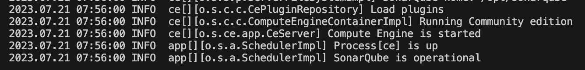
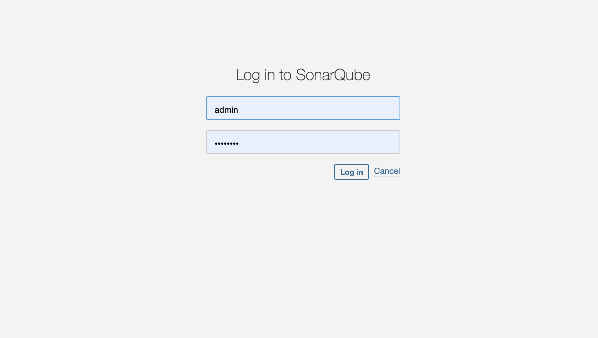
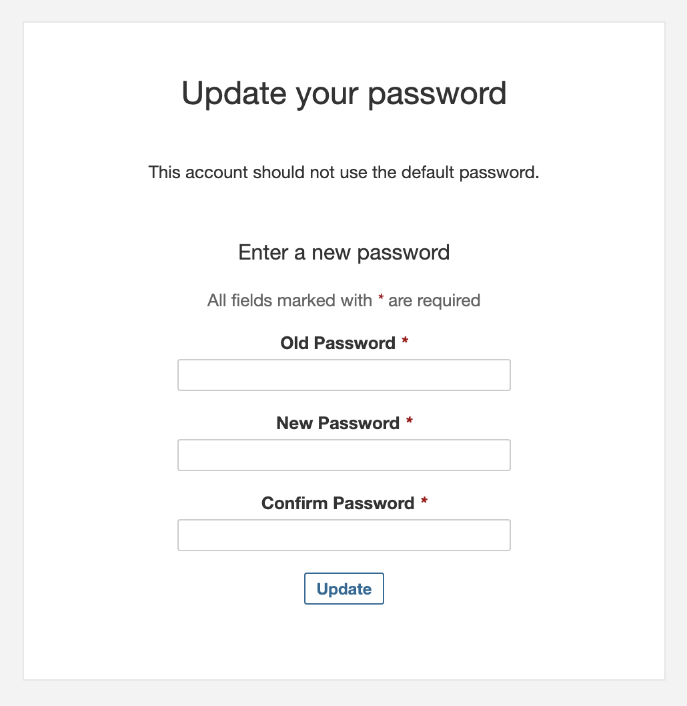
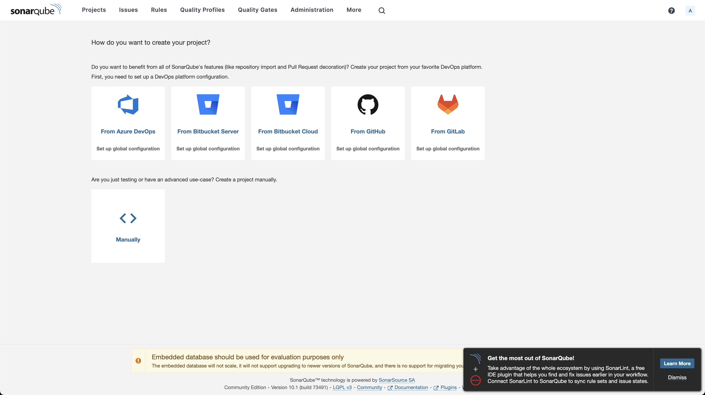
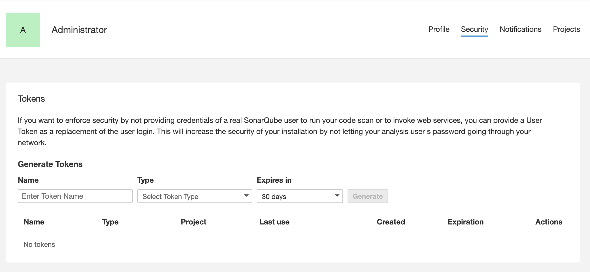
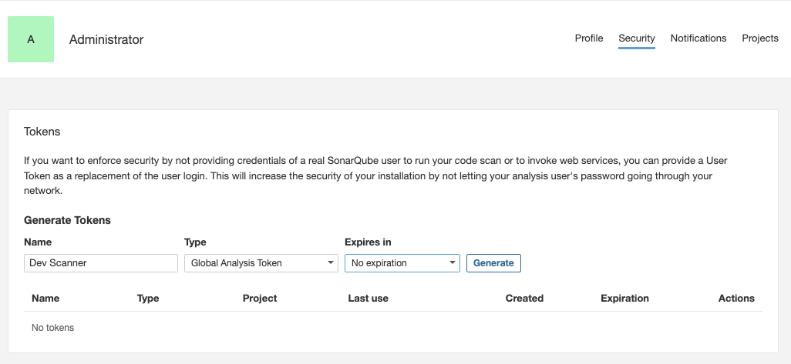
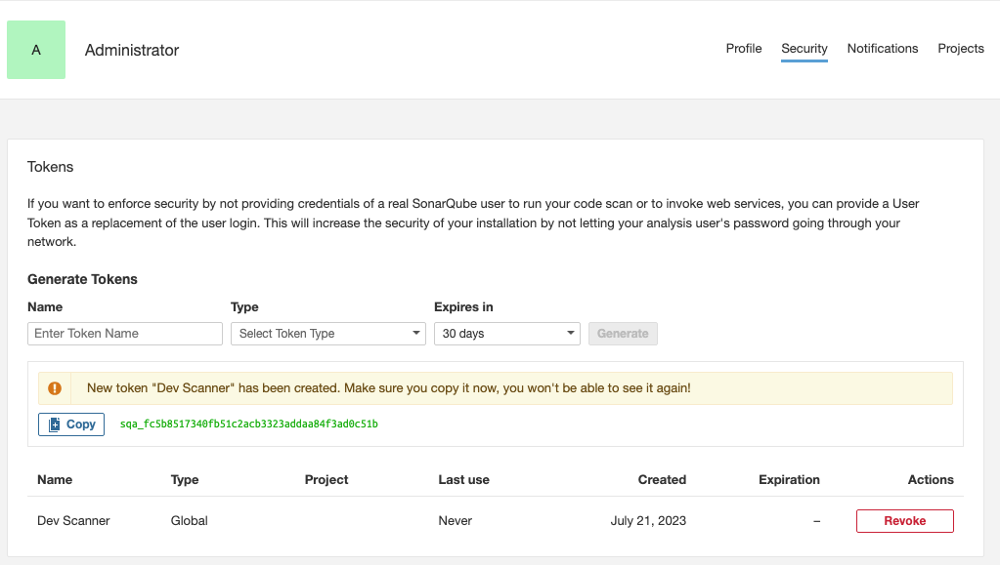
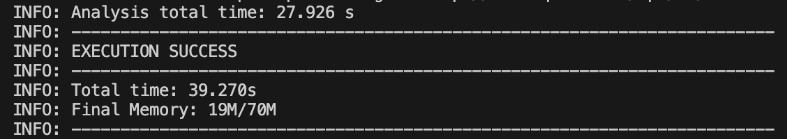
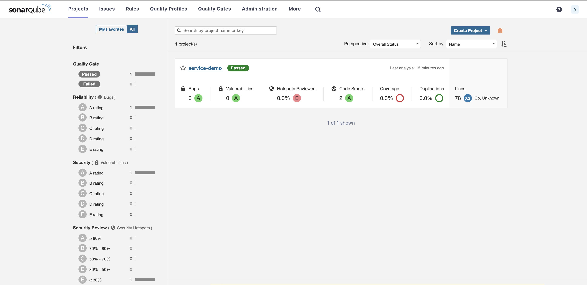
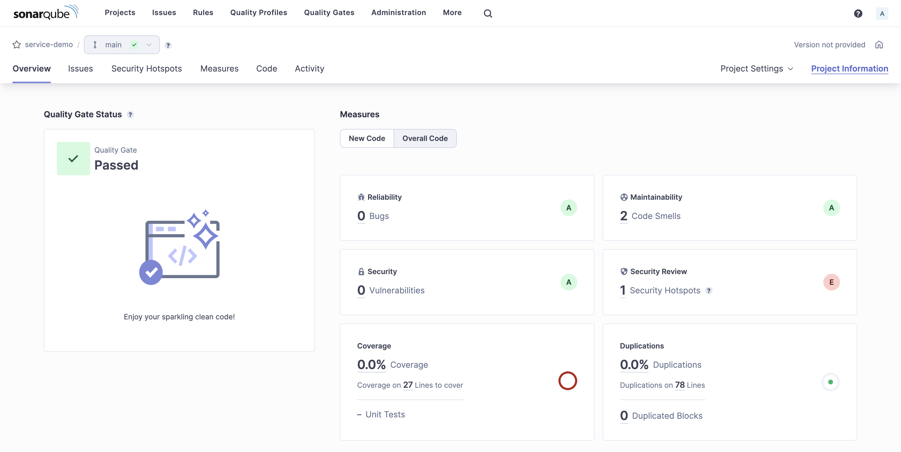

## Introducción
Como desarrolladores en algún momento nos enfrentaremos al hecho de evaluar nuestro código con alguna herramienta de análisis de código, en este caso haremos uso de de una herramienta open source llamada SonarQube, la cual nos permitirá hacer análisi de código estático

<!--more-->

A continuación, te explicaré los pasos necesarios para realizar un análisis de código estático con SonarQube utilizando Docker sin necesidad de instalar nada adicional en tu sistema.


## Paso 1: Configuración del entorno de SonarQube

1. Asegúrate de tener Docker instalado en tu sistema. Puedes verificarlo ejecutando el comando:

``` sh
docker --version
```

Si no lo tienes instalado, consulta la documentación oficial de Docker para obtener instrucciones de instalación.
<!-- Agregar liks a la doc oficial  -->

2. Descarga la imagen de SonarQube desde Docker Hub utilizando el siguiente comando:
  
``` sh
docker pull sonarqube
```

3. Inicia un contenedor de SonarQube utilizando el siguiente comando:
  
``` sh
docker run -d --name sonarqube -p 9000:9000 sonarqube
```

Esto iniciará un contenedor llamado "sonarqube" y expondrá el puerto 9000 del contenedor al puerto 9000 del host.

4. Espera unos momentos hasta que el contenedor de SonarQube se haya iniciado correctamente.

Si queremos saber cuando esté listo el contenedor de sonarqube tendremos que ver los logs y para ello usaremos el siguiente comando:

```sh
docker logs -f sonarqube
```

Sabremos que ya está listo para ser usado cuando veamos algo así con el mensaje `SonarQube is operational` tal como lo muestra la siguiente imagen



Ahora que ya ha iniciado el sonarqube podemos acceder desde la siguiente url

[http://localhost:9000/](http://localhost:9000/)

al acceder estaremos viendo la siguiente pantalla



las  credenciales por defecto son las siguientes:

- **Username:** admin 
- **Password:** admin 

Al iniciar por primera nos aparecerá la siguiente pantalla y nos solicitará que cambiemos de contraseña:



Seguiremos las instrucciones para actualizar la contraseña, y una vez actualizada la contraseña nos mostrará la página de inicio tal como se ve a continuación



Como podemos ver no hay ningún proyecto dado de alta, por lo nos ofrece varias opciones para dar de alta los proyectos por medio de integraciones y también de manera manual.

Para este ejemplo práctico ingresamos la página de perfil 


y después navegaremos a la sección de seguridad



En esta página generaremos un token el cual nos permitirá utilizarlo como autenticación cuando hagamos los análisis, solo es cuestión de introducir los datos solicitados.



Una vez creado el token debemos debemos de almacenarlo, ya que solo se mostrará una sola vez. Esté se verá a como se muestra en la siguiente imágen.



## Paso 2: Preparación del proyecto y análisis de código

1. Nos aseguraremos de tener un proyecto de código fuente listo para el análisis. Puede ser un proyecto de Java, golang, TypeScript, JavaScript, etc. 

Para este tutorial usaremos un servicio de prueba en golang, el cual lo podemos desgcargar desde este [repositorio en github](https://github.com/JacquezLabs/service-demo) o utilizar el siguiente comando para clonar el repositorio en nuestro equipo local.

```sh
git clone https://github.com/JacquezLabs/service-demo.git
```

2. Ahora descargamos el escáner de SonarQube (SonarScanner) en nuestro sistema local por medio de docker usando el siguiente comando.

```sh
docker pull sonarsource/sonar-scanner-cli
```

3. Lo siguiente a realizar es preparar el archivo de configuración del SonarScanner para nuestro proyecto. 
Ahora en la misma terminal que usamos para clonar el repositorio, usaremos los siguientes comando para movernos al directorio de nuestro código fuente y generamos un archivo llamado `sonar-project.properties` 

```sh
cd service-demo/
touch sonar-project.properties
```
lo siguiente que haremos será agregar las configuraciones al archivo `sonar-project.properties`  y para este ejemplo le agregaremos lo siguiente:

```properties
sonar.projectKey=service-demo
sonar.exclusions=sonar.properties
sonar.source=.
```

4. Realizaremos el análisis de código estático utilizando la imagen de SonarScanner en nuestro proyecto y para eso ejecutaremos el siguiente comando en la terminal, estando en el directorio raíz de nuestro proyecto:

``` sh
docker run --rm -v $(PWD):/usr/src --link sonarqube -e SONAR_HOST_URL=http://sonarqube:9000 sonarsource/sonar-scanner-cli -Dsonar.token=<token>
```
> **Nota:** Recuerda utilizar el token generado anteriormente

Al finalizar el comando nos aparecerá un mensaje de que ha finalizado correctamente, tal como lo podemos ver en la siguiente imágen:



5. Si ahora vamos al navegador web y visitamos de nuevo al panel de control de nuestro sonarqube ([http://localhost:9000](http://localhost:9000)) podremos ver que ya nos aparece los resultados del análisis de código estático de nuestro proyecto, tal como podemos ver a continuación:



Y si accedemos al proyecto podremos ver el resultado a detalle del análisis:



¡Y eso es todo! Ahora hemos configurado y utilizado SonarQube con Docker para realizar análisis de código estático en nuestro proyecto sin necesidad de instalar nada adicional en nuestro sistema. 

Recuerda que este tutorial solo abarca los pasos básicos, y hay muchas más opciones y configuraciones disponibles en SonarQube para personalizar y profundizar en tus análisis.


