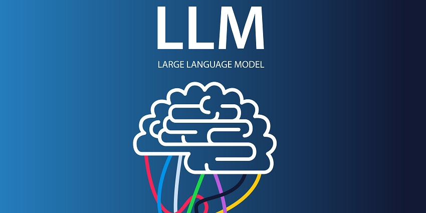

## Large Language Models (LLMs): An Overview

Large Language Models (LLMs) represent a significant leap in the capabilities of machine learning models to understand and generate human-like text based on the context. Over the years, they have garnered considerable attention due to their vast potential in various applications.

### What are LLMs?

LLMs are a type of artificial neural network trained on enormous amounts of textual data. Their primary function is to predict the next word in a sequence, but they can perform a variety of tasks ranging from text generation to answering questions.

#### Key Features

1. **Scale:** These models can have billions, or even trillions, of parameters.
2. **Versatility:** LLMs can perform tasks without task-specific training data by leveraging their vast knowledge.
3. **Transfer Learning:** Models like LLMs can be fine-tuned for specific tasks, building on their generic training.

### Prominent Examples

- **GPT (Generative Pre-trained Transformer)**: Developed by OpenAI, GPT variants like GPT-3 and GPT-4 have set benchmarks in the field of natural language processing.
- **BERT (Bidirectional Encoder Representations from Transformers)**: Proposed by Google, it revolutionized the way we think about natural language understanding tasks.

### Potential Applications

- **Conversational AI:** Chatbots and virtual assistants.
- **Content Generation:** Writing articles, poetry, or even code.
- **Education:** Assisting students in learning and answering their queries.
- **Research:** Summarizing articles, suggesting research directions, etc.

### Concerns and Challenges

- **Bias:** LLMs can reflect and amplify biases present in their training data.
- **Interpretability:** Understanding why an LLM makes a specific decision is challenging.
- **Environmental Impact:** Training LLMs require significant computational resources, raising concerns about their carbon footprint.

### Conclusion

LLMs, with their immense capabilities, have the potential to revolutionize many sectors. As we advance, it's crucial to address the challenges they present to harness their full potential responsibly.

---

_References:_

- [OpenAI Blog](https://www.openai.com/)

- [BERT: Pre-training of Deep Bidirectional Transformers for Language Understanding](https://arxiv.org/abs/1810.04805)
