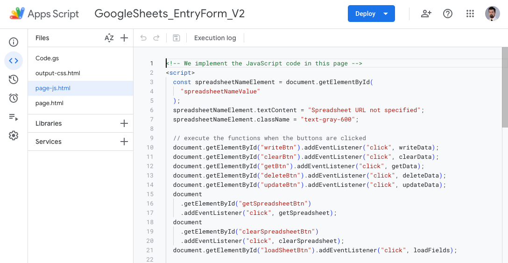
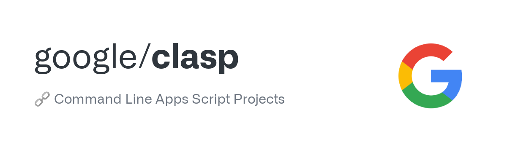

Google Apps Script (GAS) is not just another application development platform; it's a powerful JavaScript library tailored to interact seamlessly with the G Suite applications. With GAS, you can create bespoke solutions, optimize workflows, and derive maximum value from the G Suite ecosystem. Whether you're a seasoned developer or a business professional, GAS provides the tools to transform your ideas into functional applications.


## Key Features of GAS

- **Custom Menus in G Suite Apps**: Enhance Google Sheets or Docs with tailored menus that initiate your scripts.
- **Automate Workflows**: Design scripts to send Gmails based on specific criteria, automating routine tasks.
- **Integrate Google Services**: Seamlessly sync data between Sheets and Google Contacts or automate Google Calendar event additions from form submissions.
- **Custom Functions for Google Sheets**: Elevate your data processing in Sheets by crafting your own functions.
- **Web App Development**: Design and deploy web applications using GAS for internal or external users.

## Advantages of GAS

- **Cost-Efficiency**: Eliminate the need for costly third-party integrations with this free offering from Google.
- **Flexibility**: Customize solutions to meet specific requirements.
- **Security**: Rely on the robust security infrastructure that Google provides for its applications.

## The Challenge: GAS's Built-in IDE

While GAS provides an integrated development environment (IDE) that facilitates quick scripting, it's not without its limitations. Developers often find challenges in:

- Synchronizing their scripts with platforms like GitHub.
- The absence of features that are standard in popular editors like [Visual Studio Code](https://code.visualstudio.com).
- Organizing complex codebases efficiently.


<!-- TODO: Add a footer to the image -->

## The Solution: `clasp`

Enter `clasp` (Command Line Apps Script Projects), a game-changing tool for GAS developers. At its core, `clasp` acts as a bridge, connecting the proprietary environment of GAS's IDE with the vast world of modern local editors.



Here's how clasp revolutionizes the GAS development process:

- **Local Development:** By synchronizing with the GAS remote repository, `clasp` lets you develop scripts on your local machine. This means you're no longer confined to the online IDE; instead, you can work in the familiar environment of your preferred local editor, be it [Visual Studio Code](https://code.visualstudio.com), [Atom](https://github.com/atom/atom.git), [Sublime](https://www.sublimetext.com/3), or any other. This not only enhances productivity but also makes coding more enjoyable and efficient. Modern editors come packed with extensions and tools that can aid in development, from linting and formatting to advanced debugging. With `clasp`, GAS developers can leverage these tools, resulting in cleaner, more efficient code.

- **Version Control:** With your codebase now local, it becomes vastly simpler to manage version control. Traditional tools like `git` can be employed, offering powerful tracking, branching, and collaboration capabilities.

- **Push to Popular Repositories:** Having your GAS projects stored locally allows them to tap into the collaborative and open-source advantages offered by platforms like [GitHub](https://github.com).

At its core, `clasp` dismantles the limitations of GAS's IDE, offering developers the flexibility and resources inherent in modern IDEs. The diagram below illustrates a potential integration setup facilitated by `clasp`. In this model, GAS's IDE seamlessly syncs with Visual Studio Code, which concurrently manages the code base stored in a GitHub Remote Repository.


## Setting Up clasp: A Step-by-step Guide

To help you integrate `clasp` into your GAS development process, here's a detailed walkthrough:

### 1.Install Node.js and NPM

Ensure you have Node.js (version 4.7.4 or later). Download the installer for your platform [here](https://nodejs.org/en/download/current).

After installation, validate with:

```bash
node -v
npm -v
```

### 2. Install clasp

For MacOS or Linux:

```bash
sudo npm i @google/clasp -g
```

If you are using Windows, open the terminal with the action `Run as administrator`:

```bash
npm i @google/clasp -g
```

Post-installation, verify with `clasp -v`.

### 3. Activate the Google Apps Script API

Navigate to the Apps Script Settings page, click on `Google Apps Script API` and toggle the switch to `On`.


### 4. Authenticate `clasp` with Your GAS Account

Execute `clasp login` and follow the browser instructions.

```bash
clasp login
```

### 5. Initialise a Node Project

Execute:

```bash
npm init
```

The end result will be a new `package.json` file.

### 6. Retrieve Your GAS Project Files

Use:

```bash
clasp clone + “[ID of your GAS project]”
```

Locate the ID in your GAS remote repository settings:


As a result, all your GAS files will be created locally on your computer. This will allow you to access them via your preferred IDE.

_Note: Local GAS files use the .js extension, but `clasp` handles the conversion to .gs seamlessly._

### 7. Push changes to the GAS Remote Repository

Once you have written some code, you can deploy it to the GAS Remote Repository with:

```bash
clasp push
```

Optionally, you can create a `.claspignore` file to list the files that should not be pushed into the GAS Remote Repository.

Alternitely, you can use `clasp push -w`. This option stands for `watch` and it allows `clasp` to push the code every time you save the file you're working on, so you don't have to run the `clasp push` command every time.

```bash
clasp push -w
```

You can stop the terminal from listening to changes by pressing `Ctrl + C` on your keyboard.

### 8. Pull changes from the GAS remote repo into your local machine

Use the `clasp pull` command to fetch the latest from the GAS Remote Repository:

```bash
clasp pull
```

## Conclusion

Harnessing the power of Google Apps Script can revolutionize the way you interact with G Suite applications. Coupled with `clasp`, the potential to innovate, automate, and optimize becomes boundless. Whether you're on a quest to amplify efficiency in your daily tasks or to dive deep into the world of automation, GAS and `clasp` offer the resources to transform your ideas into reality.

---

_**References:**_

- [Overview of all clasp features](https://developers.google.com/apps-script/guides/clasp)
