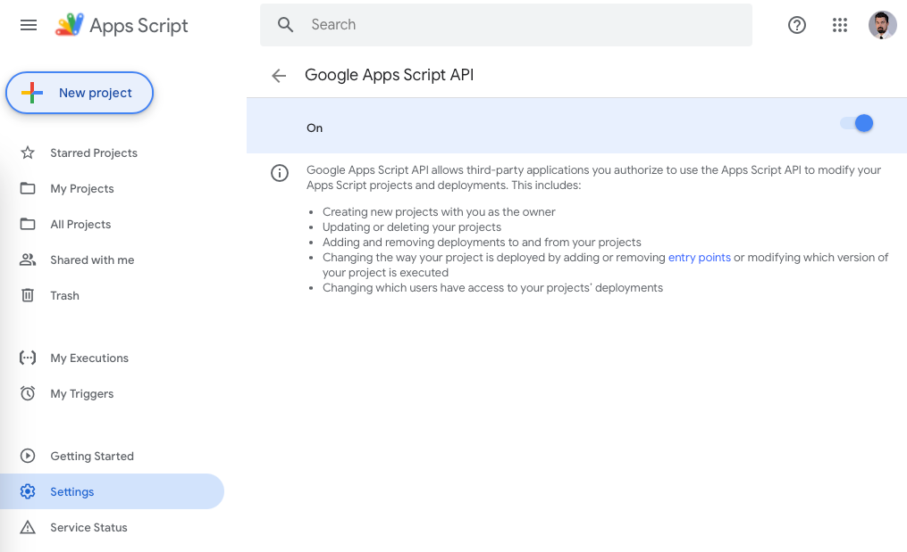

Harness the capabilities of Google Apps Script (GAS) to optimize your workflows, design bespoke solutions, and extract the utmost value from G Suite applications. Whether you're a seasoned developer or a business professional looking to automate mundane tasks, GAS provides the platform to bring your ideas to life.


## Key Features of GAS

- **Custom Menus in G Suite Apps**: Enhance Google Sheets or Docs with tailored menus that initiate your scripts.
- **Automate Workflows**: Design scripts to send Gmails based on specific criteria, automating routine tasks.
- **Integrate Google Services**: Seamlessly sync data between Sheets and Google Contacts or automate Google Calendar event additions from form submissions.
- **Custom Functions for Google Sheets**: Elevate your data processing in Sheets by crafting your own functions.
- **Web App Development**: Design and deploy web applications using GAS for internal or external users.

## Advantages of GAS

- **Cost-Efficiency**: Eliminate the need for costly third-party integrations with this free offering from Google.
- **Flexibility**: Customize solutions to meet specific requirements.
- **Security**: Rely on the robust security infrastructure that Google provides for its applications.

## Local Development with clasp

Clasp (Command Line Apps Script Projects) allows you to develop GAS projects on your local machine. This means leveraging your preferred tools like git and [Visual Studio Code](https://code.visualstudio.com), and synchronizing seamlessly with the cloud.

Follow these steps to set up clasp in your machine:

### 1.Install Node.js and NPM

Ensure you have Node.js (version 4.7.4 or later). Download the installer for your platform [here](https://nodejs.org/en/download/current).

After installation, validate with:

```bash
node -v
npm -v
```

### 2. Install clasp

For MacOS or Linux:

```bash
sudo npm i @google/clasp -g
```

If you are using Windows, open the terminal with the action `Run as administrator`:

```bash
npm i @google/clasp -g
```

Post-installation, verify with `clasp -v`.

### 3. Activate the Google Apps Script API

Navigate to the Apps Script Settings page, click on `Google Apps Script API` and toggle the switch to `On`.



### 4. Authenticate clasp with Your GAS Account

Execute `clasp login` and follow the browser instructions.

```bash
clasp login
```

### 5. Initialise a Node Project

Execute:

```bash
npm init
```

The end result will be a new `package.json` file.

### 6. Retrieve Your GAS Project Files

Use:

```bash
clasp clone + “[ID of your GAS project]”
```

Locate the ID in your GAS remote repository settings:


As a result, all your GAS files will be created locally on your computer. This will allow you to access them via your preferred IDE.

_Note: Local GAS files use the .js extension, but clasp handles the conversion to .gs seamlessly._

### 7. Push changes to the GAS Remote Repository

Once you have written some code, you can deploy it to the GAS Remote Repository with:

```bash
clasp push
```

Optionally, you can create a `.claspignore` file to list the files that should not be pushed into the GAS Remote Repository.

Alternitely, you can use `clasp push -w`. This option stands for `watch` and it allows clasp to push the code every time you save the file you're working on, so you don't have to run the clasp push command every time.

```bash
clasp push -w
```

You can stop the terminal from listening to changes by pressing `Ctrl + C` on your keyboard.

### 8. Pull changes from the GAS remote repo into your local machine

Use the `clasp pull` command to fetch the latest from the GAS Remote Repository:

```bash
clasp pull
```

## Conclusion

Harnessing the power of Google Apps Script can revolutionize the way you interact with G Suite applications. Coupled with `clasp`, the potential to innovate, automate, and optimize becomes boundless. Whether you're on a quest to amplify efficiency in your daily tasks or to dive deep into the world of automation, GAS and `clasp` offer the resources to transform your ideas into reality.

---

_Further reading: [Overview of all clasp features](https://developers.google.com/apps-script/guides/clasp)_
