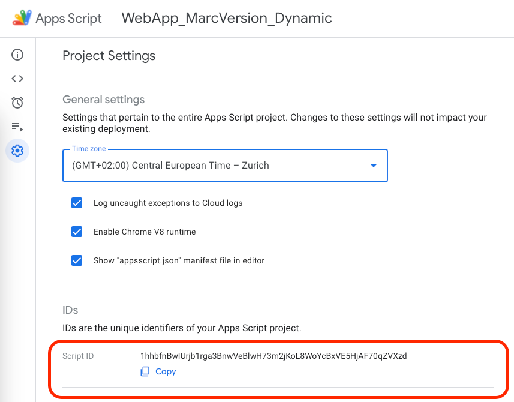

Google Apps Script (GAS) is a powerful tool that can help businesses and individuals streamline their workflows, create custom solutions, and maximize the potential of G Suite applications. Whether you're a seasoned developer or a business professional looking to automate mundane tasks, GAS provides the platform to bring your ideas to life.


Some examples of what you can do with GAS:

- **Custom Functions for Google Sheets**: Instead of relying only on built-in functions, you can define your own to process data in Sheets.
- **Automate Workflows**: For instance, you can set up a script to automatically send emails from Gmail based on certain criteria.
- **Custom Menus in G Suite Apps**: Add new menus in Google Sheets or Docs that can trigger custom scripts.
- **Connecting Different Google Services**: Automatically add Google Calendar events from form submissions, or sync data between Sheets and Google Contacts.
- **Develop Web Apps**: Build web applications with GAS and publish them either for internal company use or for the broader public.

The benefits of using GAS are multiple:

- **Cost-Effective**: Since GAS is a free tool provided by Google, it reduces the need for third-party integrations which might be expensive.
- **Flexibility**: Can be tailored to very specific needs.
- **Security**: Being a Google product, it’s backed by the same security model that Google uses for its own applications.

## Write Google Apps Script locally with clasp

Clasp (Command Line Apps Script Projects) lets you to develop your Apps Script projects locally. You can write code on your own computer and upload it to Apps Script when you're done. You can also download existing Apps Script projects so that you can edit them when you're offline. Since the code is local, you can use your favorite development tools like git and VS Code when building Apps Script projects.

Follow these steps to get your local development environment ready:

### 1.Install Node.js and NPM in your machine

Clasp is written in Node.js and distributed via the npm tool. Prior to using clasp, you must have Node.js version 4.7.4 or later installed.

You can find the Node.js and NPM installer for your platform [here](https://nodejs.org/en/download/current).

Once the installation is complete, run the commands `node -v` and `npm -v` in your terminal to verify that the expected version of the packages was correctly installed:

```bash
node -v
npm -v
```

### 2. Install clasp in your machine

To install clasp on MacOS or Linux, open a terminal and run the command:

```bash
sudo npm i @google/clasp -g
```

If you are using Windows, open the terminal (i.e. Command Prompt) with the action "Run as administrator". 

Once the installation is complete, run `clasp -v` to find out the version of clasp installed. If the terminal returns the version number, this would mean that the installation was successful:

### 3. Enable the Google Apps Script API in your account

Before we start using clasp, we need to enable the Google Apps Script API, because that's what clasp uses in the background.
Navigate to the Apps Script Settings page, click on "Google Apps Script API" and toggle the switch to "On".


### 4. Grant clasp access to your Google Apps Script account

Run the clasp login command to save your client credentials using Google SSO.

```bash
clasp login
```

This command will open a browser tab where you will need to login with your Google account.

### 5. Initialise a node project

To do this, run the command `npm init`   in a terminal and press enter at each prompt to proceed through the installation.

```bash
npm init
```

The end result will be a new "package.json" file.

### 6. Clone the files of your GAS project in your machine

To do this, run the command `clasp clone + “[ID of your GAS project]”`

```bash
clasp clone + “[ID of your GAS project]”
```

You can find the ID of your GAS Project in the Settings of your GAS remote repository:



As a result, all your GAS files will be created locally on your computer. This will allow you to access them via your preferred IDE.

You will notice that the file extensions of the GAS files on your local machine are .js rather than .gs. That's fine, clasp does the conversion between the two extensions automatically.

`clasp clone` will also create a ".clasp.json" file to store the script ID:

### 7. Push changes from your local machine to the GAS remote repository

Once you have written some code, you can deploy it to the GAS remote repository using the `clasp push` command.

```bash
clasp push
```

Optionally, you can also create a ".claspignore" file. Any files listed in ".claspignore" will not be pushed.

Alternitely, you can use `clasp push -w`. This option stands for "watch", it allows clasp to push the code every time you save the file you're working on, so you don't have to run the clasp push command every time.

```bash
clasp push -w
```


You can stop the terminal from listening to changes by pressing Ctrl + C on your keyboard.

### 8. Pull changes from the GAS remote repo into your local machine

Use the `clasp pull` command to pull changes from the remote GAS repository to your local machine.

```bash
clasp pull
```

_References:_ [Overview of all clasp features](https://developers.google.com/apps-script/guides/clasp)

_Note: Like any online platform, always remember to follow best practices for security and privacy, especially if you're handling sensitive information._
