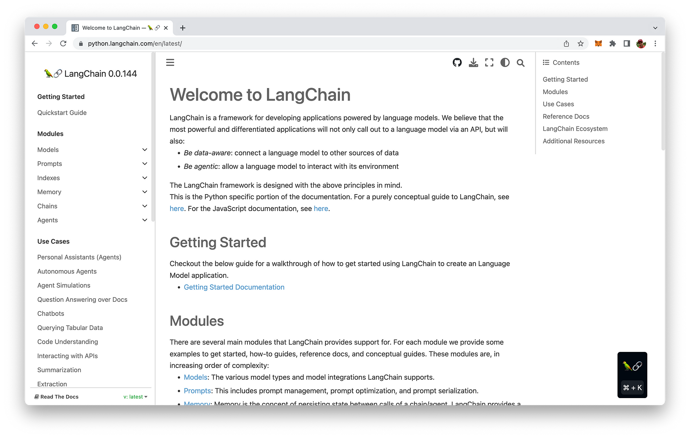
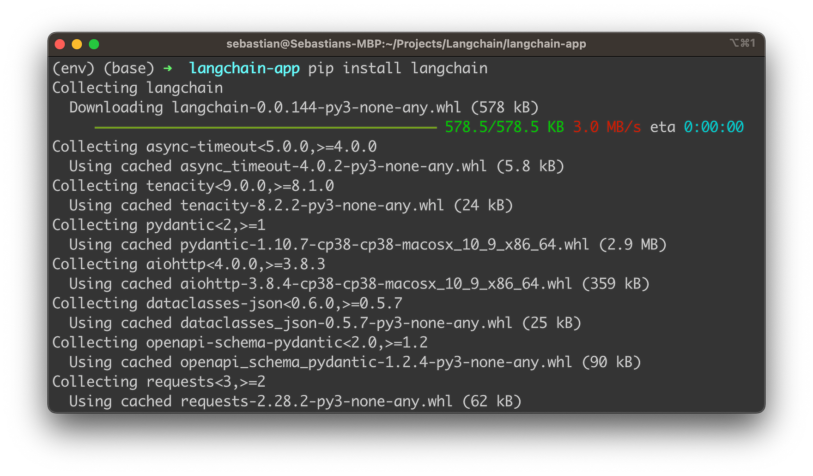
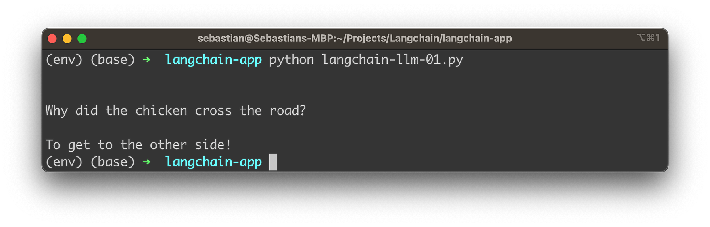

# Welcome to “Unlocking the Power of LLMs with LangChain: A Beginner’s Guide”!

In this blog post, we will explore the fascinating world of Large Language Models (LLMs) and the revolutionary framework, LangChain. As interest in LLMs and generative AI continues to soar, the need for a user-friendly and versatile toolkit has become increasingly apparent. LangChain, created by Harrison Chase, is an exceptional solution that allows developers to seamlessly build advanced applications around LLMs, such as chatbots, Generative Question-Answering systems, summarization tools, and more.

In this beginner’s guide, we will walk you through the fundamentals of LangChain, its core components, and how to leverage its capabilities to create powerful language-based applications. Whether you’re new to the world of LLMs or looking to take your language generation projects to the next level, this guide will provide you with valuable insights and hands-on examples to unlock the full potential of LangChain. Let’s dive in and start harnessing the power of LLMs today!

## Introducing LangChain

Over the past few years, Large Language Models (LLMs) have taken the world of artificial intelligence by storm. With the groundbreaking release of OpenAI’s GPT-3 in 2020, we have witnessed a steady surge in the popularity of LLMs, which has only intensified with recent advancements in the field. These powerful AI models have opened up new possibilities for natural language processing applications, enabling developers to create more sophisticated, human-like interactions in chatbots, question-answering systems, summarization tools, and beyond.

Amidst this rapidly evolving landscape, LangChain has emerged as a versatile framework designed to help developers harness the full potential of LLMs for a wide range of applications. Built around the core concept of “chaining” different components together, LangChain simplifies the process of working with LLMs like GPT-3, GPT-4, and others, allowing you to create customized, advanced use cases with ease.

In this beginner’s guide, our goal is to provide you with a comprehensive introduction to LangChain, walking you through its essential features, demonstrating how to build a simple application, and offering practical tips and best practices to help you make the most of this powerful framework. Whether you are new to LLMs or looking for a streamlined approach to building language generation applications, this guide will serve as a valuable resource to help you unlock the power of LLMs with LangChain.

The project’s website can be found at [https://python.langchain.com/en/latest/](https://python.langchain.com/en/latest/).



## LangChain's Building Blocks & Use Cases

In this section, we will walk you through the main building blocks of LangChain and explore some common use cases to give you a better understanding of the framework's potential.

### Main LangChain Building Blocks

- **Models:** LangChain offers support for various model types and model integrations. It enables you to easily integrate and work with different language models, enhancing your applications' capabilities.
- **Prompts:** LangChain allows you to manage, optimize, and serialize prompts efficiently. This helps in generating more accurate and contextually relevant responses from the language models.
- **Memory:** LangChain provides a standard interface for memory and a collection of memory implementations. It facilitates the persistence of state between calls in a chain or agent, enhancing the model's knowledge and recall abilities.
- **Indexes:** To boost the power of language models, LangChain helps you effectively combine them with your own text data. It provides best practices for indexing and searching through your data sources.
- **Chains:** Chains are sequences of calls, either to language models or other utilities. LangChain offers a standard interface for chains, along with numerous integrations and end-to-end chains for common applications.
- **Agents:** Agents enable language models to make decisions, take actions, observe outcomes, and repeat the process until the objective is met. LangChain provides a standard interface for agents, a selection of agents to choose from, and examples of end-to-end agents.

### Common Use Cases for LangChain

- **Autonomous Agents:** LangChain supports the development of autonomous agents like AutoGPT and BabyAGI, which are long-running agents that perform multiple steps to achieve an objective.
- **Agent Simulations:** LangChain facilitates the creation of sandbox environments where agents can interact with each other or react to events, offering insights into their long-term memory abilities.
- **Personal Assistants:** LangChain is ideal for building personal assistants that can take actions, remember interactions, and have access to your data, providing personalized assistance.
- **Question Answering:** LangChain excels in answering questions over specific documents, utilizing the information within those documents to construct accurate and relevant answers.
- **Chatbots:** Leveraging the text generation capabilities of language models, LangChain empowers the creation of engaging chatbots.
- **Querying Tabular Data:** LangChain provides guidance on using language models to query data stored in tabular formats, such as CSV files, SQL databases, or dataframes.
- **Code Understanding:** LangChain assists in using language models to query and comprehend source code from platforms like GitHub.
- **Interacting with APIs:** LangChain enables language models to interact with APIs, providing them with up-to-date information and the ability to take actions based on real-time data.
- **Extraction:** LangChain helps extract structured information from unstructured text, streamlining data analysis and interpretation.
- **Summarization:** LangChain supports the summarization of longer documents into concise, easily digestible chunks of information, making it a powerful tool for data augmentation.
- **Evaluation:** As generative models are challenging to evaluate using traditional metrics, LangChain offers prompts and chains to aid in the evaluation process using language models themselves.

Now that you have a solid understanding of the main building blocks and use cases for LangChain, you are well-equipped to start building powerful applications that harness the true potential of language models.

## Setting Up A LangChain Project With Python

The easiest way to get deeper into LangChain is to start building practical application which we'll do in the following.

Let's start by creating a new project folder first:

```bash
mkdir langchain-app
cd langchain-app
```

Next, create a new Python virtual environment:

```bash
python3 -m venv env
```

The command python3 -m venv env creates a new virtual environment named env using the Python 3 venv module.

Here's a breakdown of the command:

- python3: This specifies that the command should use Python 3 as the interpreter.
- -m venv: This flag indicates that the command should run the built-in venv module, which is used for creating virtual environments.
- env: This is the name of the virtual environment you want to create. In this case, the virtual environment will be named env.
A virtual environment is an isolated Python environment that allows you to install packages and dependencies specific to a particular project, without interfering with your system-wide Python installation or other projects. This isolation helps maintain consistency and avoid potential conflicts between different project requirements.

Once the virtual environment is created, you can activate it using the following command:

```bash
source env/bin/activate
```

With the virtual environment activated, we're ready to install the needed dependencies for our project. First we start with the installation of LangChain by using the following command:

```bash
pip install langchain
```

The output on the console should then look like the following:



Let's continue installing the openai package:

```bash
pip install openai
```

This package is required in order to be able to make use of OpenAI's Large Language Models (LLM) in LangChain.

In order to be able to use OpenAI's models through LangChain you need to retrieve an API key from OpenAI as well. Follow these steps:

1. Go to the OpenAI website: https://www.openai.com/
2. Click on "Get Started" or "Sign in" if you already have an account.
3. Create an account or sign in to your existing account.
4. After signing in, you'll be directed to the OpenAI Dashboard.
5. Navigate to the API section by clicking "API" in the left sidebar menu or by visiting: https://platform.openai.com/signup
6. Follow the instructions to access or sign up for the API. If you're eligible, you'll be provided with an API key.
7. The API key should look like a long alphanumeric string (e.g., "sk-12345abcdeABCDEfghijKLMNOP").
8. To set the OpenAI Key for our environment you can use the command line:

```bash
export OPENAI_API_KEY="..."
```

Or you can include the following two lines of Python code in your script:

```python
import os
os.environ["OPENAI_API_KEY"] = "..."
```

### Using Large Language Models (LLMs) in LangChain

LangChain provides an LLM class designed for interfacing with various language model providers, such as OpenAI, Cohere, and Hugging Face. This class offers a standard interface for all LLM types. In this guide, we'll walk you through integrating LLMs with LangChain using an OpenAI LLM wrapper, although the functionalities highlighted are generic for all LLM types.



## Conclusion

We hope that this beginner's guide has provided you with a solid foundation for understanding and utilizing LangChain in your language generation projects. By unlocking the power of LLMs with LangChain, you can now build advanced applications with ease, leveraging cutting-edge models like GPT, and others to create chatbots, QA systems, summarization tools, and so much more.

As you continue to explore LangChain's capabilities and experiment with its various components, remember that the possibilities are virtually endless. This framework offers a flexible and modular approach to language generation, allowing you to create custom solutions tailored to your specific needs. Stay curious and keep learning, as the world of LLMs and generative AI is evolving rapidly, presenting new opportunities and challenges along the way.

So, go forth and harness the full potential of LangChain, using it as a powerful tool to create innovative language-based applications and elevate your projects to new heights. Happy coding, and here's to the future of LLM-powered applications!

---

## References

#### Websites

- [LangChain Official Website](https://www.langchain.com/)

- [Langchain_Python Documentation](https://python.langchain.com/docs/get_started/introduction)

- [LangChain JavaScript Documentation](https://js.langchain.com/docs/get_started/introduction)

- [LangChain GitHub Repository](https://github.com/langchain-ai/langchain)

- [Official LangChain Blog](https://blog.langchain.dev/)

- [LangChain API Reference](https://api.python.langchain.com/en/latest/api_reference.html)

- [Streamlit Documentation](https://docs.streamlit.io/en/stable/)

#### Courses and Tutorials

- [LangChain Playlist Tutorial - YouTube](https://www.youtube.com/playlist?list=PLqZXAkvF1bPNQER9mLmDbntNfSpzdDIU5)

- [Quick Introduction to LangChain (1h course)](https://www.deeplearning.ai/short-courses/langchain-chat-with-your-data/)

- [Udemy Course LangChain](https://www.udemy.com/course/langchain/)

- [LangChain Components | Beginner's Guide | 2023 - YouTube](https://www.youtube.com/watch?v=r1HjwBSS80g)

#### Medium Articles

- [Dolly2 and LangChain: A Game Changer for Data Analytics by Ashutosh Kumar](https://ashukumar27.medium.com/dolly2-and-langchain-a-game-changer-for-text-data-analytics-7518d48d0ad7)

- [The Agents of AI: Data Analysis with LLMs and LangChain Agents by Ashutosh Kumar](https://ashukumar27.medium.com/the-agents-of-ai-1402548e9b8c)

#### Harrison Chase

- [LinkedIn: Harrison Chase](https://www.linkedin.com/in/harrison-chase-961287118/)

- [Interview: Meet Harrison Chase, Founder - Berkeley 2023](https://www.youtube.com/watch?v=2OBui4DVZfM)
