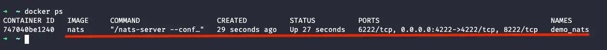
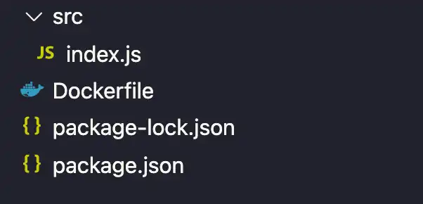
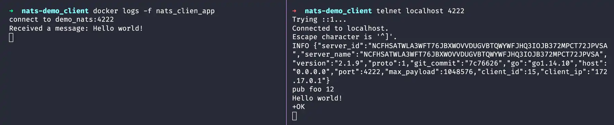

NATS es un servicio de mensajería open source que es simple, seguro y de alto rendimiento para aplicaciones nativas en la nube así como para mensajería IoT(internet de las cosas) y arquitectura de microservcios.

<!--more-->

Para poder probar y seguir con los ejemplos de este post necesitaras tener instalado docker y el editor de código de tu preferencia, si ya cuentas con esto, lo siguiente que haremos es levantar el servicio de nats usando docker, para esto abriremos una terminal y escribiremos el siguiente comando:

```sh
docker run --name demo_nats -p 4222:4222 -d nats
```

Toma en cuenta que la primera ves que levantes el servicio puededemorar un poco de tiempo.

Una vez terminado esto, verificaremos que el servicio esté arriba, para eso escribiremos este comando:

```sh
docker ps
```
y deberemos ver algo similar a como aparece en la imagen, señalado con rojo



Lo siguiente que haremos es conctarnos a NATS por medio de telnet, para lo cual abriremos dos ventanas de la terminal esto solo con fines demostrativos, en una lo que haremos es subcribirnos a un tópico y en la otra mandaremos un mensaje a ese tópico el cual será mostrado en la primera terminal donde nos hemos subscrito al tópico.

**Terminal 1**

Escribimos lo siguiente

```sh
telnet localhost 4222
```

Salida esperada
```sh
~ telnet localhost 4222
Trying ::1...
Connected to localhost.
Escape character is '^]'.
INFO {"server_id":"NCFHSATWLA3WFT76JBXWOVVDUGVBTQWYWFJHQ3IOJB372MPCT72JPVSA","server_name":"NCFHSATWLA3WFT76JBXWOVVDUGVBTQWYWFJHQ3IOJB372MPCT72JPVSA","version":"2.1.9","proto":1,"git_commit":"7c76626","go":"go1.14.10","host":"0.0.0.0","port":4222,"max_payload":1048576,"client_id":1,"client_ip":"172.17.0.1"}
```

Una vez conectados a NATS nos vamos a subscribir al tópico foo(este nombre puede ser reemplazado por el que quieras utilizar) , para eso escribimos lo siguiente

```sh
> sub foo 1
```

Salida esperada

```sh
sub foo 1
+OK
```

> **NOTA:** El símbolo ``` > ``` representa que estamos y/o escribiremos dentro de telnet y por lo tanto no debe de ser escrito, ya que si no escribimos correctamento los comandos telnet nos cerrará la sesión

**Terminal 2**

En esta terminal nos conectaremos de nuevo a NATS y enviaremos un mensaje al tópico foo, para eso repetimos este comando:

```sh
telnet localhost 4222
```

y para mandar el mensaje a travez del tópico foo escribimos lo siguiente:

```sh
> pub foo 12 # Mandamos un mensaje de 12 caracteres al topic foo
> Hello world! # Texto debe de ser de 12 caracteres exactamente, fallará si son mas o si son menos
```

> Salida esperada

```sh
pub foo 12
Hello World!
+OK
```

Esto que hemos hecho se vería más o menos así:


Hasta el momento ya hemos visto como conectarnos por medio de telnet, pero… ¿y ahora que? , ¿que sigue?

Lo siguiente que podríamos hacer es una pequeña app que solo se conecte a nuestro servidor en nats y que muestre los mensajes del tópico al que se subscriba, por lo que ahora haremos será crear un directorio, y por medio de la terminal nos posicionaremos en el directorio que acabamos de crear, en mi caso ` $HOME/dev/labs/nats-demo_client` e inicializaremos nuestro proyecto con el comando `npm init` para lo cual estaremos escribiendo el siguiente comando:

```sh
docker run -it --rm -v "$(PWD)/":/app -w /app node:15.8.0-alpine npm init -y
```

Salida esperada

```sh
$ docker run -it --rm -v "$(PWD)/":/app -w /app node:15.8.0-alpine npm init -y
Wrote to /app/package.json:

{
  "name": "app",
  "version": "1.0.0",
  "description": "",
  "main": "index.js",
  "scripts": {
    "test": "echo \"Error: no test specified\" && exit 1"
  },
  "keywords": [],
  "author": "",
  "license": "ISC"
}
```

Ahora lo que haremos es instalar el modulo de NATS para node en nuestro proyecto y eso lo haremos con esté comando:

```sh
docker run -it --rm -v "$(PWD)/":/app -w /app node:15.8.0-alpine npm i nats
```

Salida esperada

```sh
$ docker run -it --rm -v "$(PWD)/":/app -w /app node:15.8.0-alpine npm i nats

added 4 packages, and audited 5 packages in 3s
```

El siguiente paso es crear la estructura de nuestro proyecto, para lo cual abriremos nuestro IDE o editor de código favorito, en mi caso VS Code, la estructura será a como vemos en la siguiente imagen:



Lo primero que haremos será crear nuestro archivo `index.js` dentro de la carpeta `src` en cual contendrá lo siguiente

```js
const NATS = require('nats')
const nc = NATS.connect('demo_nats')

nc.on('connect', nc => {
  console.log(`connect to ${nc.currentServer.url.host}`)
})

nc.subscribe('foo', function (msg) {
  console.log('Received a message: ' + msg)
})
```

También necesitaremos crear nuestro Dockerfile el cual contendra las instrucciones necesarias para ejecutar nuestra app, y se verá de la siguiente manera:

```dockerfile
FROM node:15.8.0-alpine
WORKDIR /app
COPY package.json .
RUN npm install
COPY src ./src
CMD [ "node", "src" ]
```

compilamos nuestra app con el siguiente comando

```sh
docker build . -t nats-demo-client
```

> Salida esperada

```sh
$ docker build . -t nats-demo-client                                   [+] Building 0.1s (10/10) FINISHED
 => [internal] load build definition from Dockerfile                                                     0.0s
 => => transferring dockerfile: 36B                                                                      0.0s
 => [internal] load .dockerignore                                                                        0.0s
 => => transferring context: 2B                                                                          0.0s
 => [internal] load metadata for docker.io/library/node:15.8.0-alpine                                    0.0s
 => [internal] load build context                                                                        0.0s
 => => transferring context: 89B                                                                         0.0s
 => [1/5] FROM docker.io/library/node:15.8.0-alpine                                                      0.0s
 => CACHED [2/5] WORKDIR /app                                                                            0.0s
 => CACHED [3/5] COPY package.json .                                                                     0.0s
 => CACHED [4/5] RUN npm install                                                                         0.0s
 => CACHED [5/5] COPY src ./src                                                                          0.0s
 => exporting to image                                                                                   0.0s
 => => exporting layers                                                                                  0.0s
 => => writing image sha256:9949f43b5226738afc69a8d2e3c998f15382cc99c3b5eaf7507c17e0de940344             0.0s
 => => naming to docker.io/library/nats-demo-client                                                      0.0s
```

una vez compilada ejecutamos la app con este comando

```sh
docker run --link demo_nats --name nats_clien_app -d nats-demo-client
```

y con el siguiente comando podremos ver los logs que nos da la app

```sh
docker logs -f nats_clien_app
```

> Salida esperada

```sh
$ docker logs -f nats_clien_app
connect to demo_nats:4222
```

Nos conectamos de nuevo a nats via telnet y mandamos un mensaje

```sh
telnet localhost 4222
> pub foo 12
> Hello world!
```

y en terminal donde estamos viendo los logs de la app veremos algo parecido a esto:

```sh
$ docker logs -f nats_clien_app
connect to demo_nats:4222
Received a message: Hello world!
```

A continuación una imagen de como se verían estos ultimos pasos ya ejecutados



Y con esto hemos finalizado nuestra primer app(super sencilla) que se conecta a un servidor de NATS, espero que si llegaste hasta aquí hayas aprendido algo nuevo.

Cualquier duda, comentario y/o sugerencia los leo en los comentarios.

Hasta la próxima 🤘😎

