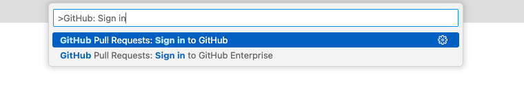
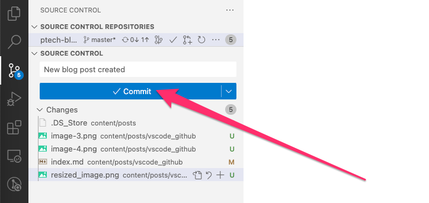
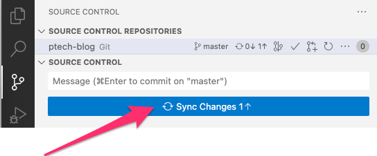
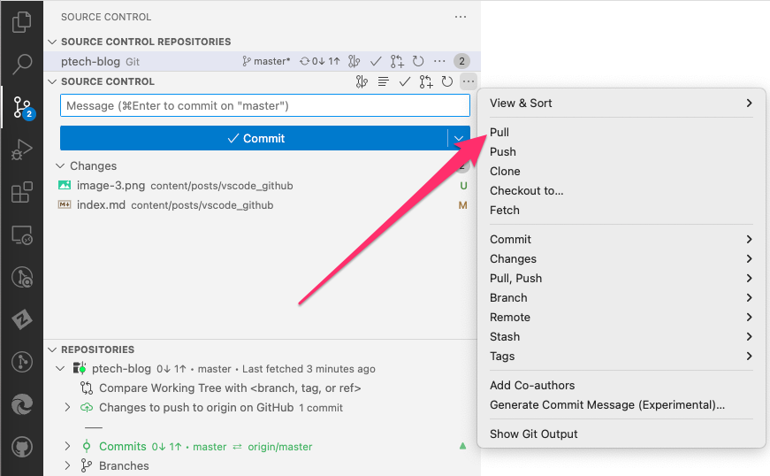

Visual Studio Code (VS Code) is a powerful code editor that has become increasingly popular among developers. One of its many strengths is the ability to integrate seamlessly with version control systems, especially GitHub. This guide will walk you through the process of connecting VS Code to your GitHub repositories, making it easier than ever to code, commit, and push.

### **Prerequisites**

- Install [Visual Studio Code](https://code.visualstudio.com/).
- Install [Git](https://git-scm.com/).
- Create a [GitHub](https://github.com/) account.
  
### **1. Install the GitHub Extension for Visual Studio Code**

Before connecting to a GitHub repository, you'll need to have the GitHub extension installed.

1. Open VS Code.
2. Navigate to the Extensions view by clicking on the square icon on the sidebar, or press `Ctrl+Shift+X`.
3. Search for "GitHub" in the search bar.
4. Find the official `GitHub Repositories` extension provided by GitHub and click `Install`.

### **2. Clone Your Repository**

Once you have the GitHub extension installed, you can clone your repository:

1. Press `F1` to open the command palette.
2. Type `Git: Clone` and select it.

3. Enter your GitHub Repository's URL.
4. Choose a directory on your computer where you'd like to store the code.
5. Open the cloned repository in VS Code.

### **3. Authenticate with GitHub**

To push or pull changes, you'll need to authenticate:

1. In VS Code, open the command palette with `F1`.
2. Type `GitHub: Sign in` and select it.

3. Follow the prompts to authenticate using either a token or your login credentials.

### **4. Making Changes and Pushing to GitHub**

With the repository cloned and authentication set up, you can now make changes to your code:

1. Make changes to your files in VS Code.
2. Open the `Source Control` panel by clicking the branching icon on the sidebar.
3. Click the `Commit`button to commit your changes:

4. Click the `Sync Changes` button to push your commits to your GitHub Repository.

### **5. Pulling Changes from GitHub**

If you're working in a team or across different machines, you might want to pull the latest changes from GitHub:

1. Open the `Source Control` panel by clicking the branching icon on the sidebar.
2. Click the `...` icon and choose `Pull` to fetch the latest updates.

### **Conclusion**

Connecting VS Code to a GitHub repository offers a seamless development experience. By integrating these tools, you can enjoy the robust code editing features of VS Code while easily tracking and managing changes with GitHub. Embrace this setup to streamline your coding and collaboration endeavors!

---

_Further reading: [Visual Studio Marketplace - GitHub Repositories Extension](https://marketplace.visualstudio.com/items?itemName=GitHub.remotehub)_

_Reminder: Like any online platform, always remember to follow best practices for security and privacy, especially if you're handling sensitive information._
