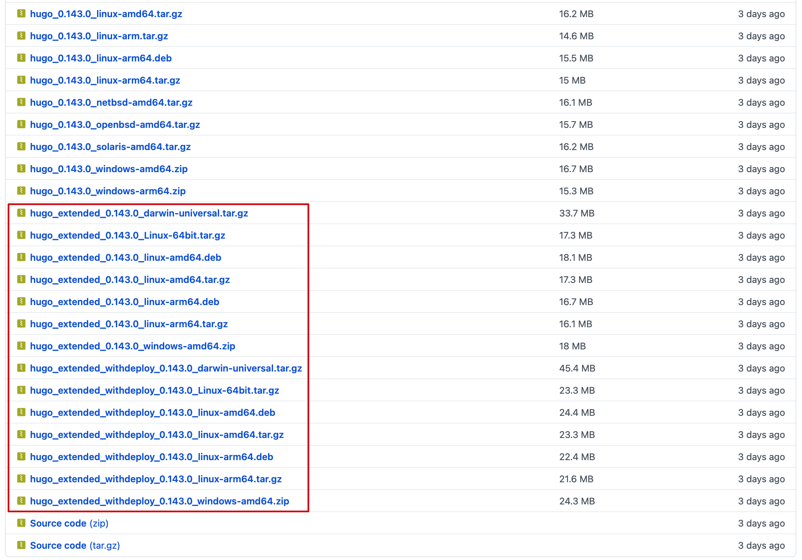
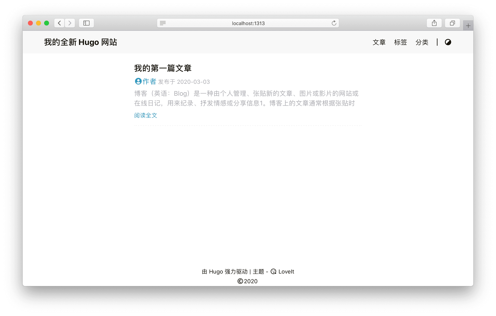
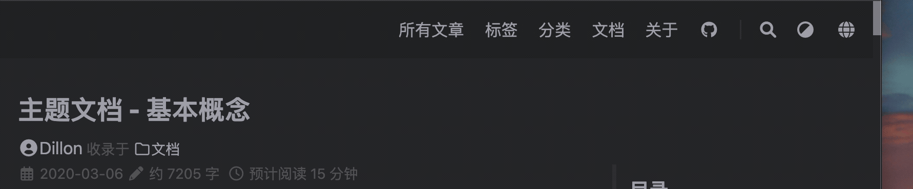

探索 Hugo - **LoveIt** 主题的全部内容和背后的核心概念.

<!--more-->

## 1 准备

由于 Hugo 提供的便利性, [Hugo](https://gohugo.io/) 是这个主题唯一的依赖.

直接安装满足你操作系统 (**Windows**, **Linux**, **macOS**) 的最新版本 [:(far fa-file-archive fa-fw): Hugo](https://gohugo.io/getting-started/installing/).


当你需要[自定义样式](#style-customization)时, 你要使用 Hugo **extended** 版本来获得正确的渲染效果.




## 2 安装

以下步骤可帮助你初始化新网站. 如果你根本不了解 Hugo, 我们强烈建议你按照此 [快速入门文档](https://gohugo.io/getting-started/quick-start/) 进一步了解它.

### 2.1 创建你的项目

Hugo 提供了一个 `new` 命令来创建一个新的网站:

```bash
hugo new site my_website
cd my_website
```

### 2.2 安装主题

**LoveIt** 主题的仓库是: [https://github.com/dillonzq/LoveIt](https://github.com/dillonzq/LoveIt).

你可以下载主题的 [发布版本 :(far fa-file-archive fa-fw): .zip 文件](https://github.com/dillonzq/LoveIt/releases) 并且解压放到 `themes` 目录.

另外, 也可以直接把这个主题克隆到 `themes` 目录:

```bash
git clone https://github.com/dillonzq/LoveIt.git themes/LoveIt
```

或者, 初始化你的项目目录为 git 仓库, 并且把主题仓库作为你的网站目录的子模块:

```bash
git init
git submodule add https://github.com/dillonzq/LoveIt.git themes/LoveIt
```



| LoveIt 分支或版本  |    支持的 Hugo 版本    |
|:--------------|:-----------------:|
| master(不稳定)   |     ≥ 0.128.0     |
| **0.3.X(推荐)** | 0.128.0 - 0.145.0 |
| 0.2.X(过时)     | 0.68.0 - 0.127.0  |



### 2.3 基础配置 {#basic-configuration}

以下是 LoveIt 主题的基本配置:

```toml
baseURL = "http://example.org/"

# 更改使用 Hugo 构建网站时使用的默认主题
theme = "LoveIt"

# 网站标题
title = "我的全新 Hugo 网站"

# 网站语言, 仅在这里 CN 大写 ["en", "zh-CN", "fr", "pl", ...]
languageCode = "zh-CN"
# 语言名称 ["English", "简体中文", "Français", "Polski", ...]
languageName = "简体中文"
# 是否包括中日韩文字
hasCJKLanguage = true

# 菜单配置
[menu]
  [[menu.main]]
    weight = 1
    identifier = "posts"
    # 你可以在名称 (允许 HTML 格式) 之前添加其他信息, 例如图标
    pre = ""
    # 你可以在名称 (允许 HTML 格式) 之后添加其他信息, 例如图标
    post = ""
    name = "文章"
    url = "/posts/"
    # 当你将鼠标悬停在此菜单链接上时, 将显示的标题
    title = ""
  [[menu.main]]
    weight = 2
    identifier = "tags"
    pre = ""
    post = ""
    name = "标签"
    url = "/tags/"
    title = ""
  [[menu.main]]
    weight = 3
    identifier = "categories"
    pre = ""
    post = ""
    name = "分类"
    url = "/categories/"
    title = ""

# Hugo 解析文档的配置
[markup]
  # 语法高亮设置 (https://gohugo.io/content-management/syntax-highlighting)
  [markup.highlight]
    # false 是必要的设置 (https://github.com/dillonzq/LoveIt/issues/158)
    noClasses = false
```


在构建网站时, 你可以使用 `--theme` 选项设置主题. 但是, 我建议你修改配置文件 (**hugo.toml**) 将本主题设置为默认主题.


### 2.4 创建你的第一篇文章

以下是创建第一篇文章的方法:

```bash
hugo new posts/first_post.md
```

通过添加一些示例内容并替换文件开头的标题, 你可以随意编辑文章.


默认情况下, 所有文章和页面均作为草稿创建. 如果想要渲染这些页面, 请从元数据中删除属性 `draft: true`, 设置属性 `draft: false` 或者为 `hugo` 命令添加 `-D`/`--buildDrafts` 参数.


### 2.5 在本地启动网站

使用以下命令启动网站:

```bash
hugo serve
```

去查看 `http://localhost:1313`.




当你运行 `hugo serve` 时, 当文件内容更改时, 页面会随着更改自动刷新.



由于本主题使用了 Hugo 中的 `.Scratch` 来实现一些特性,
非常建议你为 `hugo server` 命令添加 `--disableFastRender` 参数来实时预览你正在编辑的文章页面.

```bash
hugo serve --disableFastRender
```



### 2.6 构建网站

当你准备好部署你的网站时, 运行以下命令:

```bash
hugo
```

会生成一个 `public` 目录, 其中包含你网站的所有静态内容和资源. 现在可以将其部署在任何 Web 服务器上.


网站内容可以通过 [Netlify](https://www.netlify.com/) 自动发布和托管 (了解有关[通过 Netlify 进行 HUGO 自动化部署](https://www.netlify.com/blog/2015/07/30/hosting-hugo-on-netlifyinsanely-fast-deploys/) 的更多信息).
或者, 您可以使用 [AWS Amplify](https://gohugo.io/hosting-and-deployment/hosting-on-aws-amplify/), [Github pages](https://gohugo.io/hosting-and-deployment/hosting-on-github/), [Render](https://gohugo.io/hosting-and-deployment/hosting-on-render/) 以及更多...


## 3 配置

### 3.1 网站配置 {#site-configuration}

除了 [Hugo 全局配置](https://gohugo.io/overview/configuration/) 和 [菜单配置](#basic-configuration) 之外, **LoveIt** 主题还允许您在网站配置中定义以下参数 (这是一个示例 `hugo.toml`, 其内容为默认值).

请打开下面的代码块查看完整的示例配置 :(far fa-hand-point-down fa-fw)::

```toml
baseURL = "http://example.org/"

# 更改使用 Hugo 构建网站时使用的默认主题
theme = "LoveIt"

# 网站标题
title = "我的全新 Hugo 网站"

# 网站语言, 仅在这里 CN 大写 ["en", "zh-CN", "fr", "pl", ...]
languageCode = "zh-CN"
# 语言名称 ["English", "简体中文", "Français", "Polski", ...]
languageName = "简体中文"
# 是否包括中日韩文字
hasCJKLanguage = true

# 版权描述，仅仅用于 SEO
copyright = ""

# 是否使用 robots.txt
enableRobotsTXT = true
# 是否使用 git 信息
enableGitInfo = true
# 是否使用 emoji 代码
enableEmoji = true

# 忽略一些构建错误
ignoreErrors = ["error-remote-getjson", "error-missing-instagram-accesstoken"]

# 分页配置
[pagination]
  disableAliases = false
  pagerSize = 10
  path = "page"

# 菜单配置
[menu]
  [[menu.main]]
    weight = 1
    identifier = "posts"
    # 你可以在名称 (允许 HTML 格式) 之前添加其他信息, 例如图标
    pre = ""
    # 你可以在名称 (允许 HTML 格式) 之后添加其他信息, 例如图标
    post = ""
    name = "文章"
    url = "/posts/"
    # 当你将鼠标悬停在此菜单链接上时, 将显示的标题
    title = ""
  [[menu.main]]
    weight = 2
    identifier = "tags"
    pre = ""
    post = ""
    name = "标签"
    url = "/tags/"
    title = ""
  [[menu.main]]
    weight = 3
    identifier = "categories"
    pre = ""
    post = ""
    name = "分类"
    url = "/categories/"
    title = ""

[params]
  # 网站默认主题样式 ["auto", "light", "dark"]
  defaultTheme = "auto"
  # 公共 git 仓库路径，仅在 enableGitInfo 设为 true 时有效
  gitRepo = ""
  #  哪种哈希函数用来 SRI, 为空时表示不使用 SRI
  # ["sha256", "sha384", "sha512", "md5"]
  fingerprint = ""
  #  日期格式
  dateFormat = "2006-01-02"
  # 网站标题, 用于 Open Graph 和 Twitter Cards
  title = "我的网站"
  # 网站描述, 用于 RSS, SEO, Open Graph 和 Twitter Cards
  description = "这是我的全新 Hugo 网站"
  # 网站图片, 用于 Open Graph 和 Twitter Cards
  images = ["/logo.png"]

  # 作者配置
  [params.author]
    name = "xxxx"
    email = ""
    link = ""

  # 页面头部导航栏配置
  [params.header]
    # 桌面端导航栏模式 ["fixed", "normal", "auto"]
    desktopMode = "fixed"
    # 移动端导航栏模式 ["fixed", "normal", "auto"]
    mobileMode = "auto"
    #  页面头部导航栏标题配置
    [params.header.title]
      # LOGO 的 URL
      logo = ""
      # 标题名称
      name = ""
      # 你可以在名称 (允许 HTML 格式) 之前添加其他信息, 例如图标
      pre = ""
      # 你可以在名称 (允许 HTML 格式) 之后添加其他信息, 例如图标
      post = ""
      #  是否为标题显示打字机动画
      typeit = false

  # 页面底部信息配置
  [params.footer]
    enable = true
    #  自定义内容 (支持 HTML 格式)
    custom = ''
    #  是否显示 Hugo 和主题信息
    hugo = true
    #  是否显示版权信息
    copyright = true
    #  是否显示作者
    author = true
    # 网站创立年份
    since = 2019
    # ICP 备案信息，仅在中国使用 (支持 HTML 格式)
    icp = ""
    # 许可协议信息 (支持 HTML 格式)
    license = '<a rel="license external nofollow noopener noreffer" href="https://creativecommons.org/licenses/by-nc/4.0/" target="_blank">CC BY-NC 4.0</a>'

  #  Section (所有文章) 页面配置
  [params.section]
    # section 页面每页显示文章数量
    paginate = 20
    # 日期格式 (月和日)
    dateFormat = "01-02"
    # RSS 文章数目
    rss = 10

  #  List (目录或标签) 页面配置
  [params.list]
    # list 页面每页显示文章数量
    paginate = 20
    # 日期格式 (月和日)
    dateFormat = "01-02"
    # RSS 文章数目
    rss = 10

  #  应用图标配置
  [params.app]
    # 当添加到 iOS 主屏幕或者 Android 启动器时的标题, 覆盖默认标题
    title = "我的网站"
    # 是否隐藏网站图标资源链接
    noFavicon = false
    # 更现代的 SVG 网站图标, 可替代旧的 .png 和 .ico 文件
    svgFavicon = ""
    # Android 浏览器主题色
    themeColor = "#ffffff"
    # Safari 图标颜色
    iconColor = "#5bbad5"
    # Windows v8-10磁贴颜色
    tileColor = "#da532c"

  #  搜索配置
  [params.search]
    enable = true
    # 搜索引擎的类型 ["lunr", "algolia"]
    type = "lunr"
    # 文章内容最长索引长度
    contentLength = 4000
    # 搜索框的占位提示语
    placeholder = ""
    #  最大结果数目
    maxResultLength = 10
    #  结果内容片段长度
    snippetLength = 50
    #  搜索结果中高亮部分的 HTML 标签
    highlightTag = "em"
    #  是否在搜索索引中使用基于 baseURL 的绝对路径
    absoluteURL = false
    [params.search.algolia]
      index = ""
      appID = ""
      searchKey = ""

  # 主页配置
  [params.home]
    #  RSS 文章数目
    rss = 10
    # 主页个人信息
    [params.home.profile]
      enable = true
      # Gravatar 邮箱，用于优先在主页显示的头像
      gravatarEmail = ""
      # 主页显示头像的 URL
      avatarURL = "/images/avatar.png"
      #  主页显示的网站标题 (支持 HTML 格式)
      title = ""
      # 主页显示的网站副标题 (允许 HTML 格式)
      subtitle = "这是我的全新 Hugo 网站"
      # 是否为副标题显示打字机动画
      typeit = true
      # 是否显示社交账号
      social = true
      #  免责声明 (支持 HTML 格式)
      disclaimer = ""
    # 主页文章列表
    [params.home.posts]
      enable = true
      # 主页每页显示文章数量
      paginate = 6
      #  被 params.page 中的 hiddenFromHomePage 替代
      # 当你没有在文章前置参数中设置 "hiddenFromHomePage" 时的默认行为
      defaultHiddenFromHomePage = false

  # 作者的社交信息设置
  [params.social]
    GitHub = "xxxx"
    Linkedin = ""
    X = "xxxx" # 
    Twitter = "" # 
    Instagram = "xxxx"
    Facebook = "xxxx"
    Telegram = "xxxx"
    Medium = ""
    Gitlab = ""
    Youtubelegacy = ""
    Youtubecustom = ""
    Youtubechannel = ""
    Tumblr = ""
    Quora = ""
    Keybase = ""
    Pinterest = ""
    Reddit = ""
    Codepen = ""
    FreeCodeCamp = ""
    Bitbucket = ""
    Stackoverflow = ""
    Weibo = ""
    Odnoklassniki = ""
    VK = ""
    Flickr = ""
    Xing = ""
    Snapchat = ""
    Soundcloud = ""
    Spotify = ""
    Bandcamp = ""
    Paypal = ""
    Fivehundredpx = ""
    Mix = ""
    Goodreads = ""
    Lastfm = ""
    Foursquare = ""
    Hackernews = ""
    Kickstarter = ""
    Patreon = ""
    Steam = ""
    Twitch = ""
    Strava = ""
    Skype = ""
    Whatsapp = ""
    Zhihu = ""
    Douban = ""
    Angellist = ""
    Slidershare = ""
    Jsfiddle = ""
    Deviantart = ""
    Behance = ""
    Dribbble = ""
    Wordpress = ""
    Vine = ""
    Googlescholar = ""
    Researchgate = ""
    Mastodon = ""
    Thingiverse = ""
    Devto = ""
    Gitea = ""
    XMPP = ""
    Matrix = ""
    Bilibili = ""
    Discord = ""
    DiscordInvite = ""
    Lichess = ""
    ORCID = ""
    Pleroma = ""
    Kaggle = ""
    MediaWiki = ""
    Plume = ""
    HackTheBox = ""
    RootMe = ""
    Malt = "" # 
    TikTok = "" # 
    TryHackMe = "" # 
    Codeberg = "" # 
    HuggingFace = "" # 
    Threads = "" # 
    Phone = ""
    Email = "xxxx@xxxx.com"
    RSS = true # 

  #  文章页面全局配置
  [params.page]
    #  是否在主页隐藏一篇文章
    hiddenFromHomePage = false
    #  是否在搜索结果中隐藏一篇文章
    hiddenFromSearch = false
    #  是否使用 twemoji
    twemoji = false
    # 是否使用 lightgallery
    lightgallery = false
    #  是否使用 ruby 扩展语法
    ruby = true
    #  是否使用 fraction 扩展语法
    fraction = true
    #  是否使用 fontawesome 扩展语法
    fontawesome = true
    # 是否在文章页面显示原始 Markdown 文档链接
    linkToMarkdown = true
    #  是否在 RSS 中显示全文内容
    rssFullText = false
    #  目录配置
    [params.page.toc]
      # 是否使用目录
      enable = true
      #  是否保持使用文章前面的静态目录
      keepStatic = false
      # 是否使侧边目录自动折叠展开
      auto = true
    #  代码配置
    [params.page.code]
      # 是否显示代码块的复制按钮
      copy = true
      # 默认展开显示的代码行数
      maxShownLines = 50
    #   数学公式
    [params.page.math]
      enable = true
      #  默认行内定界符是 $ ... $ 和 \( ... \)
      inlineLeftDelimiter = ""
      inlineRightDelimiter = ""
      #  默认块定界符是 $$ ... $$, \[ ... \],  \begin{equation} ... \end{equation} 和一些其它的函数
      blockLeftDelimiter = ""
      blockRightDelimiter = ""
      # KaTeX 插件 copy_tex
      copyTex = true
      # KaTeX 插件 mhchem
      mhchem = true
    #   配置
    [params.page.mapbox]
      # Mapbox GL JS 的 access token
      accessToken = ""
      # 浅色主题的地图样式
      lightStyle = "mapbox://styles/mapbox/light-v10?optimize=true"
      # 深色主题的地图样式
      darkStyle = "mapbox://styles/mapbox/dark-v10?optimize=true"
      # 是否添加 
      navigation = true
      # 是否添加 
      geolocate = true
      # 是否添加 
      scale = true
      # 是否添加 
      fullscreen = true
    #  文章页面的分享信息设置
    [params.page.share]
      enable = true
      X = true # 
      Twitter = false # 
      Threads = true # 
      Facebook = true
      Linkedin = false
      Whatsapp = false
      Pinterest = false
      Tumblr = false
      HackerNews = true
      Reddit = false
      VK = false
      Buffer = false
      Xing = false
      Line = true
      Instapaper = false
      Pocket = false
      Flipboard = false
      Weibo = true
      Blogger = false
      Baidu = false
      Odnoklassniki = false
      Evernote = false
      Skype = false
      Trello = false
      Diaspora = true # 
      Mix = false
      Telegram = true # 
    #  评论系统设置
    [params.page.comment]
      enable = false
      #  评论系统设置
      [params.page.comment.disqus]
        # 
        enable = false
        # Disqus 的 shortname，用来在文章中启用 Disqus 评论系统
        shortname = ""
      #  评论系统设置
      [params.page.comment.gitalk]
        # 
        enable = false
        owner = ""
        repo = ""
        clientId = ""
        clientSecret = ""
      #  评论系统设置
      [params.page.comment.valine]
        enable = false
        appId = ""
        appKey = ""
        placeholder = ""
        avatar = "mp"
        meta= ""
        pageSize = 10
        # 为空时自动适配当前主题 i18n 配置
        lang = ""
        visitor = true
        recordIP = true
        highlight = true
        enableQQ = false
        serverURLs = ""
        #  emoji 数据文件名称, 默认是 "google.yml"
        # ["apple.yml", "google.yml", "facebook.yml", "twitter.yml"]
        # 位于 "themes/LoveIt/assets/lib/valine/emoji/" 目录
        # 可以在你的项目下相同路径存放你自己的数据文件:
        # "assets/lib/valine/emoji/"
        emoji = ""
      # 设置
      [params.page.comment.facebook]
        enable = false
        width = "100%"
        numPosts = 10
        appId = ""
        # 为空时自动适配当前主题 i18n 配置
        languageCode = "zh_CN"
      #   评论系统设置
      [params.page.comment.telegram]
        enable = false
        siteID = ""
        limit = 5
        height = ""
        color = ""
        colorful = true
        dislikes = false
        outlined = false
      #   评论系统设置
      [params.page.comment.commento]
        enable = false
      #   评论系统设置
      [params.page.comment.utterances]
        enable = false
        # owner/repo
        repo = ""
        issueTerm = "pathname"
        label = ""
        lightTheme = "github-light"
        darkTheme = "github-dark"
      # giscus comment 评论系统设置 (https://giscus.app/zh-CN)
      [params.page.comment.giscus]
        # 你可以参考官方文档来使用下列配置
        enable = false
        repo = ""
        repoId = ""
        category = "Announcements"
        categoryId = ""
        # 为空时自动适配当前主题 i18n 配置
        lang = ""
        mapping = "pathname"
        reactionsEnabled = "1"
        emitMetadata = "0"
        inputPosition = "bottom"
        lazyLoading = false
        lightTheme = "light"
        darkTheme = "dark"
    #  第三方库配置
    [params.page.library]
      [params.page.library.css]
        # someCSS = "some.css"
        # 位于 "assets/"
        # 或者
        # someCSS = "https://cdn.example.com/some.css"
      [params.page.library.js]
        # someJavascript = "some.js"
        # 位于 "assets/"
        # 或者
        # someJavascript = "https://cdn.example.com/some.js"
    #  页面 SEO 配置
    [params.page.seo]
      # 图片 URL
      images = []
      # 出版者信息
      [params.page.seo.publisher]
        name = ""
        logoUrl = ""

  #  TypeIt 配置
  [params.typeit]
    # 每一步的打字速度 (单位是毫秒)
    speed = 100
    # 光标的闪烁速度 (单位是毫秒)
    cursorSpeed = 1000
    # 光标的字符 (支持 HTML 格式)
    cursorChar = "|"
    # 打字结束之后光标的持续时间 (单位是毫秒, "-1" 代表无限大)
    duration = -1

  # 网站验证代码，用于 Google/Bing/Yandex/Pinterest/Baidu
  [params.verification]
    google = ""
    bing = ""
    yandex = ""
    pinterest = ""
    baidu = ""

  #  网站 SEO 配置
  [params.seo]
    # 图片 URL
    image = ""
    # 缩略图 URL
    thumbnailUrl = ""

  #  网站分析配置
  [params.analytics]
    # 
    enable = true
    # Google Analytics
    [params.analytics.google]
      id = ""
      #  是否匿名化用户 IP
      anonymizeIP = true
      #  是否遵循浏览器的 “Do Not Track” 设置
      respectDoNotTrack = false
    # Fathom Analytics
    [params.analytics.fathom]
      id = ""
      # 自行托管追踪器时的主机路径
      server = ""
    # Plausible Analytics
    [params.analytics.plausible]
      dataDomain = ""
    # Yandex Metrica
    [params.analytics.yandexMetrica]
      id = ""

  #  Cookie 许可配置
  [params.cookieconsent]
    enable = true
    # 用于 Cookie 许可横幅的文本字符串
    [params.cookieconsent.content]
      message = ""
      dismiss = ""
      link = ""

  #  第三方库文件的 CDN 设置
  [params.cdn]
    # CDN 数据文件名称, 默认不启用
    # ["jsdelivr.yml"]
    # 位于 "themes/LoveIt/assets/data/cdn/" 目录
    # 可以在你的项目下相同路径存放你自己的数据文件:
    # "assets/data/cdn/"
    data = ""

  #  兼容性设置
  [params.compatibility]
    # 是否使用 Polyfill.io 来兼容旧式浏览器
    polyfill = false
    # 是否使用 object-fit-images 来兼容旧式浏览器
    objectFit = false

# Hugo 解析文档的配置
[markup]
  # 
  [markup.highlight]
    codeFences = true
    guessSyntax = true
    lineNos = true
    lineNumbersInTable = true
    # false 是必要的设置
    # ()
    noClasses = false
  # Goldmark 是 Hugo 0.60 以来的默认 Markdown 解析库
  [markup.goldmark]
    [markup.goldmark.extensions]
      definitionList = true
      footnote = true
      linkify = true
      strikethrough = true
      table = true
      taskList = true
      typographer = true
    [markup.goldmark.renderer]
      # 是否在文档中直接使用 HTML 标签
      unsafe = true
  # 目录设置
  [markup.tableOfContents]
    startLevel = 2
    endLevel = 6

# 网站地图配置
[sitemap]
  changefreq = "weekly"
  filename = "sitemap.xml"
  priority = 0.5

# 
[Permalinks]
  # posts = ":year/:month/:filename"
  posts = ":filename"

# 
[privacy]
  #  Google Analytics 相关隐私设置 (也能在 params.analytics.google 配置)
  [privacy.googleAnalytics]
    # ...
  [privacy.twitter]
    # ...
  [privacy.youtube]
    # ...

# 用于输出 Markdown 格式文档的设置
[mediaTypes]
  [mediaTypes."text/plain"]
    suffixes = ["md"]

# 用于输出 Markdown 格式文档的设置
[outputFormats.MarkDown]
  mediaType = "text/plain"
  isPlainText = true
  isHTML = false

# 用于 Hugo 输出文档的设置
[outputs]
  # 
  home = ["HTML", "RSS", "JSON"]
  page = ["HTML", "MarkDown"]
  section = ["HTML", "RSS"]
  taxonomy = ["HTML", "RSS"]
```


请注意, 本文档其他部分将详细解释其中一些参数.



`hugo serve` 的默认运行环境是 `development`,
而 `hugo` 的默认运行环境是 `production`.

由于本地 `development` 环境的限制,
**评论系统**, **CDN** 和 **fingerprint** 不会在 `development` 环境下启用.

你可以使用 `hugo serve -e production` 命令来开启这些特性.





```toml
[params.cdn]
  # CDN 数据文件名称, 默认不启用
  # ["jsdelivr.yml"]
  data = ""
````

默认的 CDN 数据文件位于 `themes/LoveIt/assets/data/cdn/` 目录.
可以在你的项目下相同路径存放你自己的数据文件: `assets/data/cdn/`.





你可以直接配置你的社交 ID 来生成一个默认社交链接和图标:

```toml
[params.social]
  Mastodon = "@xxxx"
```

生成的社交链接是 `https://mastodon.technology/@xxxx`.

或者你可以通过一个字典来设置更多的选项:

```toml
[params.social]
  [params.social.Mastodon]
    # 排列图标时的权重 (权重越大, 图标的位置越靠后)
    weight = 0
    # 你的社交 ID
    id = "@xxxx"
    # 你的社交链接的前缀
    prefix = "https://mastodon.social/"
    # 当鼠标停留在图标上时的提示内容
    title = "Mastodon"
```

所有支持的社交链接的默认数据位于 `themes/LoveIt/assets/data/social.yaml`.
你可以参考它来配置你的社交链接.



### 3.2 网站图标, 浏览器配置, 网站清单

强烈建议你把:

* apple-touch-icon.png (180x180)
* favicon-32x32.png (32x32)
* favicon-16x16.png (16x16)
* mstile-150x150.png (150x150)
* android-chrome-192x192.png (192x192)
* android-chrome-512x512.png (512x512)

放在 `/static` 目录. 利用 [https://realfavicongenerator.net/](https://realfavicongenerator.net/) 可以很容易地生成这些文件.

可以自定义 `browserconfig.xml` 和 `site.webmanifest` 文件来设置 theme-color 和 background-color.

### 3.3 自定义样式 {#style-customization}




由于需要将 :(fab fa-sass fa-fw): SCSS 转换为 :(fab fa-css3 fa-fw): CSS, Hugo **extended** 版本对于自定义样式是必需的.


通过定义自定义 `.scss` 样式文件, **LoveIt** 主题支持可配置的样式.

包含自定义 `.scss` 样式文件的目录相对于 **你的项目根目录** 的路径为 `assets/css`.

在 `assets/css/_override.scss` 中, 你可以覆盖 `themes/LoveIt/assets/css/_variables.scss` 中的变量以自定义样式.

这是一个例子:

```scss
@import url('https://fonts.googleapis.com/css?family=Fira+Mono:400,700&display=swap&subset=latin-ext');
$code-font-family: Fira Mono, Source Code Pro, Menlo, Consolas, Monaco, monospace;
```

在 `assets/css/_custom.scss` 中, 你可以添加一些 CSS 样式代码以自定义样式.

## 4 多语言和 i18n

**LoveIt** 主题完全兼容 Hugo 的多语言模式, 并且支持在网页上切换语言.



### 4.1 兼容性 {#language-compatibility}



| 语言       | Hugo 代码 | HTML `lang` 属性 |             主题文档              |          Lunr.js 支持           |
|:---------|:-------:|:--------------:|:-----------------------------:|:-----------------------------:|
| 英语       |  `en`   |      `en`      | :(far fa-check-square fa-fw): | :(far fa-check-square fa-fw): |
| 简体中文     | `zh-cn` |    `zh-CN`     | :(far fa-check-square fa-fw): | :(far fa-check-square fa-fw): |
| 繁体中文     | `zh-tw` |    `zh-TW`     |    :(far fa-square fa-fw):    | :(far fa-check-square fa-fw): |
| 法语       |  `fr`   |      `fr`      |    :(far fa-square fa-fw):    | :(far fa-check-square fa-fw): |
| 波兰语      |  `pl`   |      `pl`      |    :(far fa-square fa-fw):    |    :(far fa-square fa-fw):    |
| 葡萄牙语(巴西) | `pt-br` |    `pt-BR`     |    :(far fa-square fa-fw):    | :(far fa-check-square fa-fw): |
| 意大利语     |  `it`   |      `it`      |    :(far fa-square fa-fw):    | :(far fa-check-square fa-fw): |
| 西班牙语     |  `es`   |      `es`      |    :(far fa-square fa-fw):    | :(far fa-check-square fa-fw): |
| 德语       |  `de`   |      `de`      |    :(far fa-square fa-fw):    | :(far fa-check-square fa-fw): |
| 塞尔维亚语    |  `pl`   |      `pl`      |    :(far fa-square fa-fw):    |    :(far fa-square fa-fw):    |
| 俄语       |  `ru`   |      `ru`      |    :(far fa-square fa-fw):    | :(far fa-check-square fa-fw): |
| 罗马尼亚语    |  `ro`   |      `ro`      |    :(far fa-square fa-fw):    | :(far fa-check-square fa-fw): |
| 越南语      |  `vi`   |      `vi`      |    :(far fa-square fa-fw):    | :(far fa-check-square fa-fw): |
| 阿拉伯语     |  `ar`   |      `ar`      |    :(far fa-square fa-fw):    | :(far fa-check-square fa-fw): |
| 加泰罗尼亚语   |  `ca`   |      `ca`      |    :(far fa-square fa-fw):    |    :(far fa-square fa-fw):    |
| 泰语       |  `th`   |      `th`      |    :(far fa-square fa-fw):    | :(far fa-check-square fa-fw): |
| 泰卢固语     |  `te`   |      `te`      |    :(far fa-square fa-fw):    |    :(far fa-square fa-fw):    |
| 印尼语      |  `id`   |      `id`      |    :(far fa-square fa-fw):    |    :(far fa-square fa-fw):    |
| 土耳其语     |  `tr`   |      `tr`      |    :(far fa-square fa-fw):    | :(far fa-check-square fa-fw): |
| 韩语       |  `ko`   |      `ko`      |    :(far fa-square fa-fw):    |    :(far fa-square fa-fw):    |
| 印地语      |  `hi`   |      `hi`      |    :(far fa-square fa-fw):    |    :(far fa-square fa-fw):    |
| 荷兰语      |  `nl`   |      `nl`      |    :(far fa-square fa-fw):    | :(far fa-check-square fa-fw): |
| 孟加拉语     |  `bn`   |      `bn`      |    :(far fa-square fa-fw):    |    :(far fa-square fa-fw):    |

### 4.2 基本配置

学习了 [Hugo如何处理多语言网站](https://gohugo.io/content-management/multilingual) 之后, 请在 [站点配置](#site-configuration) 中定义你的网站语言.

例如, 一个支持英语, 中文和法语的网站配置:

```toml
# 设置默认的语言 ["en", "zh-cn", "fr", "pl", ...]
defaultContentLanguage = "zh-cn"

[languages]
  [languages.en]
    weight = 1
    title = "My New Hugo Site"
    languageCode = "en"
    languageName = "English"
    [[languages.en.menu.main]]
      weight = 1
      identifier = "posts"
      pre = ""
      post = ""
      name = "Posts"
      url = "/posts/"
      title = ""
    [[languages.en.menu.main]]
      weight = 2
      identifier = "tags"
      pre = ""
      post = ""
      name = "Tags"
      url = "/tags/"
      title = ""
    [[languages.en.menu.main]]
      weight = 3
      identifier = "categories"
      pre = ""
      post = ""
      name = "Categories"
      url = "/categories/"
      title = ""

  [languages.zh-cn]
    weight = 2
    title = "我的全新 Hugo 网站"
    languageCode = "zh-CN"
    languageName = "简体中文"
    hasCJKLanguage = true
    [[languages.zh-cn.menu.main]]
      weight = 1
      identifier = "posts"
      pre = ""
      post = ""
      name = "文章"
      url = "/posts/"
      title = ""
    [[languages.zh-cn.menu.main]]
      weight = 2
      identifier = "tags"
      pre = ""
      post = ""
      name = "标签"
      url = "/tags/"
      title = ""
    [[languages.zh-cn.menu.main]]
      weight = 3
      identifier = "categories"
      pre = ""
      post = ""
      name = "分类"
      url = "/categories/"
      title = ""

  [languages.fr]
    weight = 3
    title = "Mon nouveau site Hugo"
    languageCode = "fr"
    languageName = "Français"
    [[languages.fr.menu.main]]
      weight = 1
      identifier = "posts"
      pre = ""
      post = ""
      name = "Postes"
      url = "/posts/"
      title = ""
    [[languages.fr.menu.main]]
      weight = 2
      identifier = "tags"
      pre = ""
      post = ""
      name = "Balises"
      url = "/tags/"
      title = ""
    [[languages.fr.menu.main]]
      weight = 3
      identifier = "categories"
      pre = ""
      post = ""
      name = "Catégories"
      url = "/categories/"
      title = ""
```

然后, 对于每个新页面, 将语言代码附加到文件名中.

单个文件 `my-page.md` 需要分为三个文件:

* 英语: `my-page.en.md`
* 中文: `my-page.zh-cn.md`
* 法语: `my-page.fr.md`


请注意, 菜单中仅显示翻译的页面. 它不会替换为默认语言内容.



也可以使用 [文章前置参数](https://gohugo.io/content-management/multilingual#translate-your-content) 来翻译网址.


### 4.3 修改默认的翻译字符串

翻译字符串用于在主题中使用的常见默认值.
目前提供[一些语言](#language-compatibility)的翻译, 但你可能自定义其他语言或覆盖默认值.

要覆盖默认值, 请在你项目的 i18n 目录 `i18n/<languageCode>.toml` 中创建一个新文件，并从 `themes/LoveIt/i18n/en.toml` 中获得提示.

另外, 由于你的翻译可能会帮助到其他人, 请花点时间通过 [:(fas fa-code-branch fa-fw): 创建一个 PR](https://github.com/dillonzq/LoveIt/pulls) 来贡献主题翻译, 谢谢!

## 5 搜索



基于 [Lunr.js](https://lunrjs.com/) 或 [algolia](https://www.algolia.com/), **LoveIt** 主题支持搜索功能.

### 5.1 输出配置

为了生成搜索功能所需要的 `index.json`, 请在你的 [网站配置](#site-configuration) 中添加 `JSON` 输出文件类型到 `outputs` 部分的 `home` 字段中.

```toml
[outputs]
  home = ["HTML", "RSS", "JSON"]
```

### 5.2 搜索配置

基于 Hugo 生成的 `index.json` 文件, 你可以激活搜索功能.

这是你的 [网站配置](#site-configuration) 中的搜索部分:

```toml
[params.search]
  enable = true
  # 搜索引擎的类型 ["lunr", "algolia"]
  type = "lunr"
  # 文章内容最长索引长度
  contentLength = 4000
  # 搜索框的占位提示语
  placeholder = ""
  #  最大结果数目
  maxResultLength = 10
  #  结果内容片段长度
  snippetLength = 50
  #  搜索结果中高亮部分的 HTML 标签
  highlightTag = "em"
  #  是否在搜索索引中使用基于 baseURL 的绝对路径
  absoluteURL = false
  [params.search.algolia]
    index = ""
    appID = ""
    searchKey = ""
```


以下是两种搜索引擎的对比:

* `lunr`: 简单, 无需同步 `index.json`, 没有 `contentLength` 的限制, 但占用带宽大且性能低 (特别是中文需要一个较大的分词依赖库)
* `algolia`: 高性能并且占用带宽低, 但需要同步 `index.json` 且有 `contentLength` 的限制

 文章内容被 `h2` 和 `h3` HTML 标签切分来提高查询效果并且基本实现全文搜索.
`contentLength` 用来限制 `h2` 和 `h3` HTML 标签开头的内容部分的最大长度.



你需要上传 `index.json` 到 algolia 来激活搜索功能. 你可以使用浏览器来上传 `index.json` 文件但是一个自动化的脚本可能效果更好.
官方提供的 [Algolia CLI](https://github.com/algolia/algolia-cli) 是一个不错的选择.
为了兼容 Hugo 的多语言模式, 你需要上传不同语言的 `index.json` 文件到对应的 algolia index, 例如 `zh-cn/index.json` 或 `fr/index.json`...

