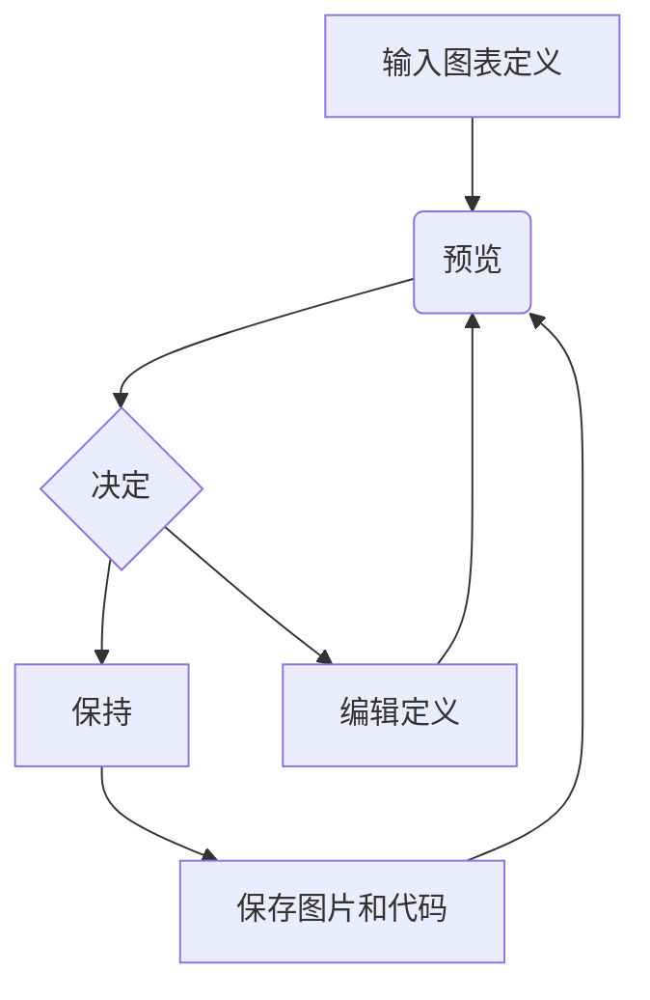

了解如何在 **LoveIt** 主题中快速, 直观地创建和组织内容.

<!--more-->

## 1 内容组织 {#contents-organization}

以下是一些方便你清晰管理和生成文章的目录结构建议:

* 保持博客文章存放在 `content/posts` 目录, 例如: `content/posts/我的第一篇文章.md`
* 保持简单的静态页面存放在 `content` 目录, 例如: `content/about.md`
* 本地资源组织




有三种方法来引用**图片**和**音乐**等本地资源:

1. 使用[页面包](https://gohugo.io/content-management/page-bundles/)中的[页面资源](https://gohugo.io/content-management/page-resources/).
   你可以使用适用于 `Resources.GetMatch` 的值或者直接使用相对于当前页面目录的文件路径来引用页面资源.
2. 将本地资源放在 **assets** 目录中, 默认路径是 `/assets`.
   引用资源的文件路径是相对于 assets 目录的.
3. 将本地资源放在 **static** 目录中, 默认路径是 `/static`.
   引用资源的文件路径是相对于 static 目录的.

引用的**优先级**符合以上的顺序.

在这个主题中的很多地方可以使用上面的本地资源引用,
例如 **链接**, **图片**, `image` shortcode, `music` shortcode 和**前置参数**中的部分参数.

页面资源或者 **assets** 目录中的[图片处理](https://gohugo.io/content-management/image-processing/)会在未来的版本中得到支持.
非常酷的功能! :(far fa-grin-squint fa-fw):


## 2 前置参数 {#front-matter}

**Hugo** 允许你在文章内容前面添加 `yaml`, `toml` 或者 `json` 格式的前置参数.


**不是所有**的以下前置参数都必须在你的每篇文章中设置.
只有在文章的参数和你的 [网站设置](../theme-documentation-basics#site-configuration) 中的 `page` 部分不一致时才有必要这么做.


这是一个前置参数例子:

```yaml
---
title: "我的第一篇文章"
subtitle: ""
date: 2020-03-04T15:58:26+08:00
lastmod: 2020-03-04T15:58:26+08:00
draft: true
author: ""
authorLink: ""
description: ""
license: ""
images: []

tags: []
categories: []

featuredImage: ""
featuredImagePreview: ""

hiddenFromHomePage: false
hiddenFromSearch: false
twemoji: false
lightgallery: true
ruby: true
fraction: true
fontawesome: true
linkToMarkdown: true
rssFullText: false

toc:
  enable: true
  auto: true
code:
  copy: true
  maxShownLines: 50
math:
  enable: false
  # ...
mapbox:
  # ...
share:
  enable: true
  # ...
comment:
  enable: true
  # ...
library:
  css:
    # someCSS = "some.css"
    # 位于 "assets/"
    # 或者
    # someCSS = "https://cdn.example.com/some.css"
  js:
    # someJS = "some.js"
    # 位于 "assets/"
    # 或者
    # someJS = "https://cdn.example.com/some.js"
seo:
  images: []
  # ...
---
```

* **title**: 文章标题.
* **subtitle**:  文章副标题.
* **date**: 这篇文章创建的日期时间. 它通常是从文章的前置参数中的 `date` 字段获取的, 但是也可以在 [网站配置](../theme-documentation-basics#site-configuration) 中设置.
* **lastmod**: 上次修改内容的日期时间.
* **draft**: 如果设为 `true`, 除非 `hugo` 命令使用了 `--buildDrafts`/`-D` 参数, 这篇文章不会被渲染.
* **author**: 文章作者.
* **authorLink**: 文章作者的链接.
* **description**: 文章内容的描述.
* **license**: 这篇文章特殊的许可.
* **images**: 页面图片, 用于 Open Graph 和 Twitter Cards.

* **tags**: 文章的标签.
* **categories**: 文章所属的类别.

* **featuredImage**: 文章的特色图片.
* **featuredImagePreview**: 用在主页预览的文章特色图片.

* **hiddenFromHomePage**: 如果设为 `true`, 这篇文章将不会显示在主页上.
* **hiddenFromSearch**:  如果设为 `true`, 这篇文章将不会显示在搜索结果中.
* **twemoji**:  如果设为 `true`, 这篇文章会使用 twemoji.
* **lightgallery**: 如果设为 `true`, 文章中的图片将可以按照画廊形式呈现.
* **ruby**:  如果设为 `true`, 这篇文章会使用 [上标注释扩展语法](#ruby).
* **fraction**:  如果设为 `true`, 这篇文章会使用 [分数扩展语法](#fraction).
* **fontawesome**:  如果设为 `true`, 这篇文章会使用 [Font Awesome 扩展语法](#fontawesome).
* **linkToMarkdown**: 如果设为 `true`, 内容的页脚将显示指向原始 Markdown 文件的链接.
* **rssFullText**:  如果设为 `true`, 在 RSS 中将会显示全文内容.

* **toc**:  和 [网站配置](../theme-documentation-basics#site-configuration) 中的 `params.page.toc` 部分相同.
* **code**:  和 [网站配置](../theme-documentation-basics#site-configuration) 中的 `params.page.code` 部分相同.
* **math**:  和 [网站配置](../theme-documentation-basics#site-configuration) 中的 `params.page.math` 部分相同.
* **mapbox**:  和 [网站配置](../theme-documentation-basics#site-configuration) 中的 `params.page.mapbox` 部分相同.
* **share**: 和 [网站配置](../theme-documentation-basics#site-configuration) 中的 `params.page.share` 部分相同.
* **comment**:  和 [网站配置](../theme-documentation-basics#site-configuration) 中的 `params.page.comment` 部分相同.
* **library**:  和 [网站配置](../theme-documentation-basics#site-configuration) 中的 `params.page.library` 部分相同.
* **seo**:  和 [网站配置](../theme-documentation-basics#site-configuration) 中的 `params.page.seo` 部分相同.




**featuredImage** 和 **featuredImagePreview** 支持[本地资源引用](#contents-organization)的完整用法.

如果带有在前置参数中设置了 `name: featured-image` 或 `name: featured-image-preview` 属性的页面资源,
没有必要在设置 `featuredImage` 或 `featuredImagePreview`:

```yaml
resources:
- name: featured-image
  src: featured-image.jpg
- name: featured-image-preview
  src: featured-image-preview.jpg
```


## 3 内容摘要

**LoveIt** 主题使用内容摘要在主页中显示大致文章信息。Hugo 支持生成文章的摘要.


### 自动摘要拆分

默认情况下, Hugo 自动将内容的前 70 个单词作为摘要.

你可以通过在 [网站配置](../theme-documentation-basics#site-configuration) 中设置 `summaryLength` 来自定义摘要长度.

如果您要使用 [CJK]^(中文/日语/韩语) 语言创建内容, 并且想使用 Hugo 的自动摘要拆分功能，请在 [网站配置](../theme-documentation-basics#site-configuration) 中将 `hasCJKLanguage` 设置为 `true`.

### 手动摘要拆分

另外, 你也可以添加 `<!--more-->` 摘要分割符来拆分文章生成摘要.

摘要分隔符之前的内容将用作该文章的摘要.


请小心输入`<!--more-->` ; 即全部为小写且没有空格.


### 前置参数摘要

你可能希望摘要不是文章开头的文字. 在这种情况下, 你可以在文章前置参数的 `summary` 变量中设置单独的摘要.

### 使用文章描述作为摘要

你可能希望将文章前置参数中的 `description` 变量的内容作为摘要.

你仍然需要在文章开头添加 `<!--more-->` 摘要分割符. 将摘要分隔符之前的内容保留为空. 然后 **LoveIt** 主题会将你的文章描述作为摘要.

### 摘要选择的优先级顺序

由于可以通过多种方式指定摘要, 因此了解顺序很有用. 如下:

1. 如果文章中有 `<!--more-->` 摘要分隔符, 但分隔符之前没有内容, 则使用描述作为摘要.
2. 如果文章中有 `<!--more-->` 摘要分隔符, 则将按照手动摘要拆分的方法获得摘要.
3. 如果文章前置参数中有摘要变量, 那么将以该值作为摘要.
4. 按照自动摘要拆分方法.


不建议在摘要内容中包含富文本块元素, 这会导致渲染错误. 例如代码块, 图片, 表格等.


## 4 Markdown 基本语法

这部分内容在 [Markdown 基本语法页面](../basic-markdown-syntax/) 中介绍.

## 5 Markdown 扩展语法 {#extended-markdown-syntax}

**LoveIt** 主题提供了一些扩展的语法便于你撰写文章.

### 图表

#### GoAT 图表 (ASCII)

```goat
      .               .                .               .--- 1          .-- 1     / 1
     / \              |                |           .---+            .-+         +
    /   \         .---+---.         .--+--.        |   '--- 2      |   '-- 2   / \ 2
   +     +        |       |        |       |    ---+            ---+          +
  / \   / \     .-+-.   .-+-.     .+.     .+.      |   .--- 3      |   .-- 3   \ / 3
 /   \ /   \    |   |   |   |    |   |   |   |     '---+            '-+         +
 1   2 3   4    1   2   3   4    1   2   3   4         '--- 4          '-- 4     \ 4
```

#### Mermaid 图表



### Emoji 支持

这部分内容在 [Emoji 支持页面](../emoji-support/) 中介绍.

### 数学公式



**LoveIt** 基于 [$\KaTeX$](https://katex.org/) 提供数学公式的支持.

在你的 [网站配置](../theme-documentation-basics#site-configuration) 中的 `[params.math]` 下面设置属性 `enable = true`,
并在文章的前置参数中设置属性 `math: true`来启用数学公式的自动渲染.
**$\KaTeX$** 根据 **特定的分隔符** 来自动渲染公式.


有一份 [$\KaTeX$ 中支持的 $\TeX$ 函数](https://katex.org/docs/supported.html) 清单.



由于 Hugo 在渲染 Markdown 文档时会根据 `_`/`*`/`>>` 之类的语法生成 HTML 文档,
并且有些转义字符形式的文本内容 (如 `\(`/`\)`/`\[`/`\]`/`\\`) 会自动进行转义处理,
因此需要对这些地方进行额外的转义字符表达来实现自动渲染:

* `_` -> `\_`
* `*` -> `\*`
* `>>` -> `\>>`
* `\(` -> `\\(`
* `\)` -> `\\)`
* `\[` -> `\\[`
* `\]` -> `\\]`
* `\\` -> `\\\\`

**LoveIt** 主题支持 [`raw` shortcode](../theme-documentation-extended-shortcodes#12-raw) 以避免这些转义字符,
它可以帮助您编写原始数学公式内容.

一个 `raw` 示例:

```markdown
行内公式: {?{}{< raw >}}\(\mathbf{E}=\sum_{i} \mathbf{E}_{i}=\mathbf{E}_{1}+\mathbf{E}_{2}+\mathbf{E}_{3}+\cdots\){?{}{< /raw >}}

公式块:

{?{}{< raw >}}
\[ a=b+c \\ d+e=f \]
{?{}{< /raw >}}
```

呈现的输出效果如下:

行内公式: \(\mathbf{E}=\sum_{i} \mathbf{E}_{i}=\mathbf{E}_{1}+\mathbf{E}_{2}+\mathbf{E}_{3}+\cdots\)

公式块:


\[ a=b+c \\ d+e=f \]



#### 行内公式

默认的行内公式分割符有:

* `$ ... $`
* `\( ... \)` (转义的: `\\( ... \\)`)

例如:

```markdown
$c = \pm\sqrt{a^2 + b^2}$ 和 \\(f(x)=\int_{-\infty}^{\infty} \hat{f}(\xi) e^{2 \pi i \xi x} d \xi\\)
```

呈现的输出效果如下:

$c = \pm\sqrt{a^2 + b^2}$ 和 \\(f(x)=\int_{-\infty}^{\infty} \hat{f}(\xi) e^{2 \pi i \xi x} d \xi\\)

#### 公式块

默认的公式块分割符有:

* `$$ ... $$`
* `\[ ... \]` (转义的: `\\[ ... \\]`)
* `\begin{equation} ... \end{equation}` (不编号的: `\begin{equation*} ... \end{equation*}`)
* `\begin{align} ... \end{align}` (不编号的: `\begin{align*} ... \end{align*}`)
* `\begin{alignat} ... \end{alignat}` (不编号的: `\begin{alignat*} ... \end{alignat*}`)
* `\begin{gather} ... \end{gather}` (不编号的: `\begin{gather*} ... \end{gather*}`)
* `\begin{CD} ... \end{CD}`

例如:

```markdown
$$ c = \pm\sqrt{a^2 + b^2} $$

\\[ f(x)=\int_{-\infty}^{\infty} \hat{f}(\xi) e^{2 \pi i \xi x} d \xi \\]

\begin{equation*}
  \rho \frac{\mathrm{D} \mathbf{v}}{\mathrm{D} t}=\nabla \cdot \mathbb{P}+\rho \mathbf{f}
\end{equation*}

\begin{equation}
  \mathbf{E}=\sum_{i} \mathbf{E}\_{i}=\mathbf{E}\_{1}+\mathbf{E}\_{2}+\mathbf{E}_{3}+\cdots
\end{equation}

\begin{align}
  a&=b+c \\\\
  d+e&=f
\end{align}

\begin{alignat}{2}
   10&x+&3&y = 2 \\\\
   3&x+&13&y = 4
\end{alignat}

\begin{gather}
   a=b \\\\
   e=b+c
\end{gather}

\begin{CD}
   A @>a\>> B \\\\
@VbVV @AAcA \\\\
   C @= D
\end{CD}
```

呈现的输出效果如下:

$$ c = \pm\sqrt{a^2 + b^2} $$

\\[ f(x)=\int_{-\infty}^{\infty} \hat{f}(\xi) e^{2 \pi i \xi x} d \xi \\]

\begin{equation*}
  \rho \frac{\mathrm{D} \mathbf{v}}{\mathrm{D} t}=\nabla \cdot \mathbb{P}+\rho \mathbf{f}
\end{equation*}

\begin{equation}
  \mathbf{E}=\sum_{i} \mathbf{E}\_{i}=\mathbf{E}\_{1}+\mathbf{E}\_{2}+\mathbf{E}_{3}+\cdots
\end{equation}

\begin{align}
  a&=b+c \\\\
  d+e&=f
\end{align}

\begin{alignat}{2}
   10&x+&3&y = 2 \\\\
   3&x+&13&y = 4
\end{alignat}

\begin{gather}
   a=b \\\\
   e=b+c
\end{gather}

\begin{CD}
   A @>a\>> B \\\\
@VbVV @AAcA \\\\
   C @= D
\end{CD}


你可以在 [网站配置](../theme-documentation-basics#site-configuration) 中自定义行内公式和公式块的分割符.


#### Copy-tex

**[Copy-tex](https://github.com/Khan/KaTeX/tree/master/contrib/copy-tex)** 是一个 **$\KaTeX$** 的插件.

通过这个扩展, 在选择并复制 $\KaTeX$ 渲染的公式时, 会将其 $\LaTeX$ 源代码复制到剪贴板.

在你的 [网站配置](../theme-documentation-basics#site-configuration) 中的 `[params.math]` 下面设置属性 `copyTex = true` 来启用 Copy-tex.

选择并复制上一节中渲染的公式, 可以发现复制的内容为 $\LaTeX$ 源代码.

#### mhchem

**[mhchem](https://github.com/Khan/KaTeX/tree/master/contrib/mhchem)** 是一个 **$\KaTeX$** 的插件.

通过这个扩展, 你可以在文章中轻松编写漂亮的化学方程式.

在你的 [网站配置](../theme-documentation-basics#site-configuration) 中的 `[params.math]` 下面设置属性 `mhchem = true` 来启用 mhchem.

```markdown
$$ \ce{CO2 + C -> 2 CO} $$

$$ \ce{Hg^2+ ->[I-] HgI2 ->[I-] [Hg^{II}I4]^2-} $$
```

呈现的输出效果如下:

$$ \ce{CO2 + C -> 2 CO} $$

$$ \ce{Hg^2+ ->[I-] HgI2 ->[I-] [Hg^{II}I4]^2-} $$

### 字符注音或者注释 {#ruby}

**LoveIt** 主题支持一种 **字符注音或者注释** Markdown 扩展语法:

```markdown
[Hugo]{?^}(一个开源的静态网站生成工具)
```

呈现的输出效果如下:

[Hugo]^(一个开源的静态网站生成工具)

### 分数 {#fraction}



**LoveIt** 主题支持一种 **分数** Markdown 扩展语法:

```markdown
[浅色]{?/}[深色]

[99]{?/}[100]
```

呈现的输出效果如下:

[浅色]/[深色]

[90]/[100]

### Font Awesome {#fontawesome}

**LoveIt** 主题使用 [Font Awesome](https://fontawesome.com/) 作为图标库.
你同样可以在文章中轻松使用这些图标.

从 [Font Awesome 网站](https://fontawesome.com/icons?d=gallery) 上获取所需的图标 `class`.

```markdown
去露营啦! {?:}(fas fa-campground fa-fw): 很快就回来.

真开心! {?:}(far fa-grin-tears):
```

呈现的输出效果如下:

去露营啦! :(fas fa-campground fa-fw): 很快就回来.

真开心! :(far fa-grin-tears):

### 转义字符 {#escape-character}

在某些特殊情况下 (编写这个主题文档时 :(far fa-grin-squint-tears):),
你的文章内容会与 Markdown 的基本或者扩展语法冲突, 并且无法避免.

转义字符语法可以帮助你渲染出想要的内容:

```markdown
{{??}X} -> X
```

例如, 两个 `:` 会启用 emoji 语法. 但有时候这不是你想要的结果. 可以像这样使用转义字符语法:

```markdown
{{??}:}joy:
```

呈现的输出效果如下:

**{?:}joy{?:}** 而不是 **:joy:**


这个方法可以间接解决一个还未解决的 **[Hugo 的 issue](https://github.com/gohugoio/hugo/issues/4978)**.


另一个例子是:

```markdown
[link{{??}]}(#escape-character)
```

呈现的输出效果如下:

**[link{?]}(#escape-character)** 而不是 **[link](#escape-character)**.
