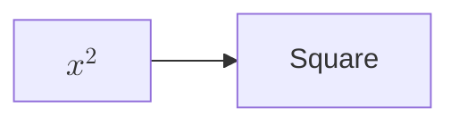
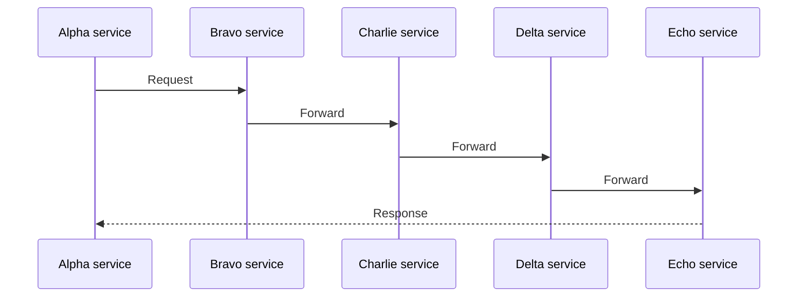

```mermaid
graph LR
    A["$$x^2$$"] --> B[Square]
```

```mermaid
sequenceDiagram
    participant Alpha as Alpha service
    participant Bravo as Bravo service
    participant Charlie as Charlie service
    participant Delta as Delta service
    participant Echo as Echo service
    Alpha->>Bravo: Request
    Bravo->>Charlie: Forward
    Charlie->>Delta: Forward
    Delta->>Echo: Forward
    Echo-->>Alpha: Response
```


graph LR
    C[Not closed --> D

